# **Expression Tree**

## **Intro**

The expression tree is a different representation of an expression. Every expression can be shown as a tree. Why does this matter? It's needed for code. It would be very inconvenient to use it when calculating, but for code it's perfect. The tree isn't only a different way of writing an expression, but it's also a *data structure*. Without this tree structure, it would be extremely difficult to write code for the expressions.

## **Order of Operations**

When looking at an expression like `x + 10 * y`, we know that the first thing to do is `10 * y` and then add `x`, but we can’t *see* the order. Here's how the tree would look like with the same example:

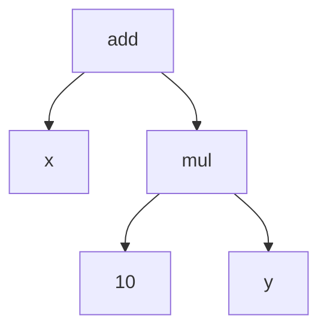

With this tree, we can tell that we do the multiplication first, and the addition second. But with `x + 10 * y`, the most natural thing for people who are used to left-to-right reading is to solve it like `(x + 10) * y`. Here are 2 trees for the same example, one going left to right and the other following the order of operations:

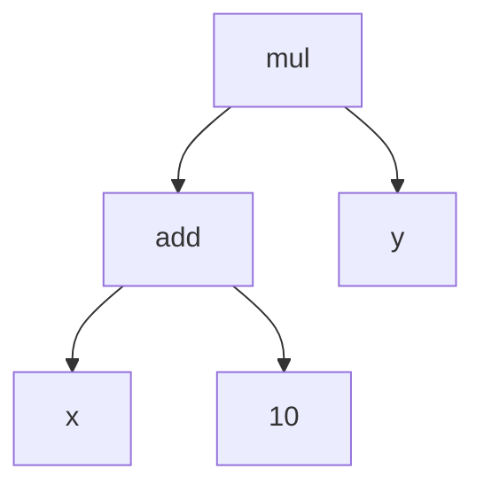


## **Properties**

All the properties of operations (commutation, association, distribution) are also easy to visualize with the tree:

### **Commutation**


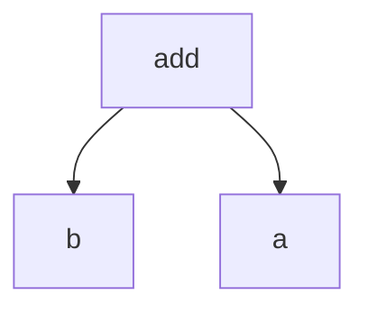


### **Association**

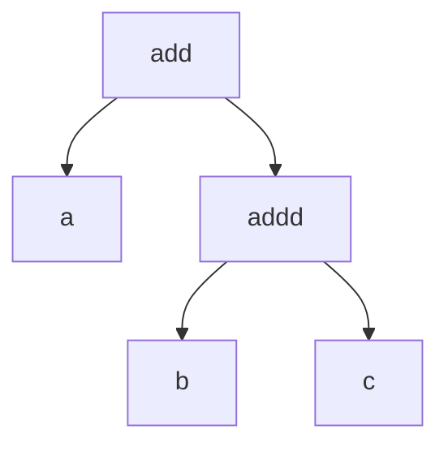
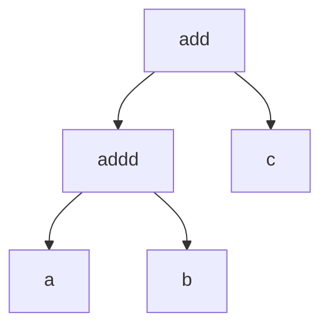

### **Distribution**

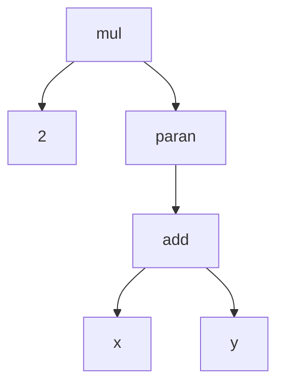

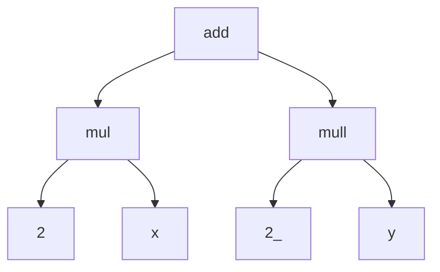

(note: distribution hasn't been implimented in my code [yet](#to-do-list))

The one downside to the tree format is that there are always different levels. For example, when adding `1 + a + 3`, it doesn’t matter which 2 numbers you add first, but with the tree you *have* to have an order. So, the tree will look like this:


The ideal solution we want is a + 4, but in this format, it will first add `1 + a`, which isn't possibile since `a` is a variable, and then add `3` to `1 + a`. This will just result in `1 + a + 3` again.

What we want instead is something like this:

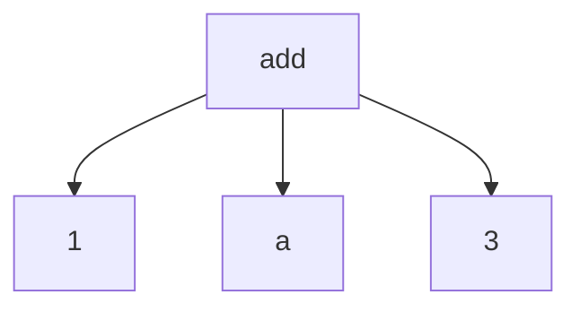

Now, all of them are on the same “level”. Since addition is commutative, we can just re-arrange the expression and add `1` and `3` like so:


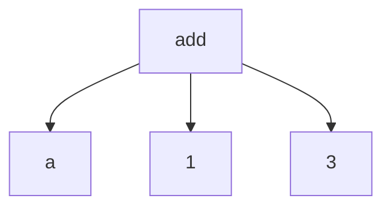

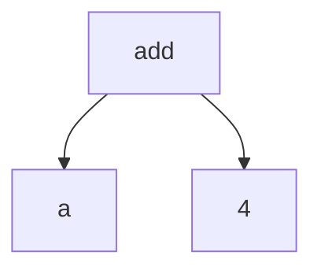

And we’ve got `a + 4`! Perfect!

So, the tree and the not-tree are both good for different scenarios, but I feel like the tree is more helpful to understand or visualize, and the not-tree form is better when solving.

# Code

This section just shows small snippets of the code, if you want to see the full thing, it’s open-source [on github](https://github.com/pengvyn/kavpix-code). All of this code is written in TypeScript and a [few libraries](#libraries)

There are 4 main functions I had to write for this:

1. Parser. It takes the input you type and transforms it into a tree
2. Orderer. Re-arranges the tree to follow the order of operations
3. Evaluater. Takes a tree as input and evaluates/solves it as much as it can.
4. Simplifier. Evaluates the expression even further (more on this later)

## **Parser**

As mentioned before, it transforms a `string` into a tree. Before we start with the function, let's see how the tree is supposed to look.

### **Expression Types**

First, we can start with a simple expression like `1 + 2`. This is how it looks like as a tree


There are three main things here: `add`, `1`, and `2`. If we generalize this, we get `operation`, `number`, and `number` 

Nice! We now know the three things needed for a tree. An object would be perfect for this

```typescript
type Operation = "add" | "sub" | "mul" | "div";

interface Expression {
    left: number,
    right: number,
    operation: Operation
}
```

Now we have a union type for the operation, the left, and the right. With all of these together we have an `Expression`!

This is good, but for a tree like

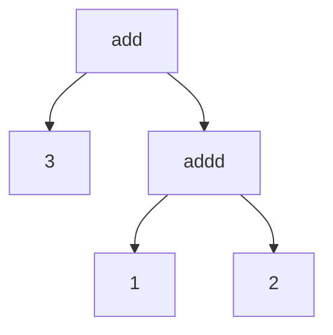

The left isn't a number. it's another `add`.

```typescript
...

interface Expression {
    left: Expression,
    right: Expression,
    operation: Operation,
}
```

That's better! Now we can have an even bigger tree. But, what about negation? It should be included in `Expression` as well, but it only has 1 value, and not left and right.

#### **Negation**

What if we had a bunch of objects, one for each operation, and one more for Negation? Then, we can make `Expression` a union type of all of those!

```typescript
interface Add {
    left: Expression,
    right: Expression,
    operation: "add",
}
interface Sub {
    left: Expression,
    right: Expression,
    operation: "sub",
}
interface Mul {
    left: Expression,
    right: Expression,
    operation: "mul",
}
interface Div {
    left: Expression,
    right: Expression,
    operation: "div",
}
interface Neg {
    val: Expression, // val is short for value
    operation: "neg",
}

type Expression = Add | Sub | Mul | Div | Neg;
```

#### **Parentheses**

Now that negation is here as well, adding parentheses is simple


```typescript
interface Add {
    left: Expression,
    right: Expression,
    _tag: "add",
}
interface Sub {
    left: Expression,
    right: Expression,
    _tag: "sub",
}
interface Mul {
    left: Expression,
    right: Expression,
    _tag: "mul",
}
interface Div {
    left: Expression,
    right: Expression,
    _tag: "div",
}
interface Neg {
    val: Expression,
    _tag: "neg",
}
interface Paran {
    val: Expression,
    _tag: "paran",
}

type Expression = Add | Sub | Mul | Div | Neg | Paran;
```

I've changed `operation` into `_tag` because parantheses isn't really an operation, and `tag` fit better. The underscore is there to differenciate it between the other elements in the object: left, right, or val. 

The tag is needed to know which object is which. When a function takes in an expression, it might not know what expression it is. With the tag, we can tell exactly whether it's `Add`, or `Div`, or something else.

#### **Leaf**

We're almost done with the types, there's just one more `interface` needed. None of the `interface`s have numbers or variables. It's always an expression. This means that adding a number or variable to the tree would give a type error. Let's fix that!

```typescript
...

const _variables = ["a", "b", "c", "d", "e", "f", "g", "h", "i", "j", "k", "l", "m", "n", "o", "p", "q", "r", "s", "t", "u", "v", "w", "x", "y", "z"] as const;
type Variable = typeof _variables[number];

interface VarLeaf { // short for Variable Leaf
    val: Variable,
    _tag: "var",
}
interface ValLeaf { // short for Value Leaf
    val: number,
    _tag: "val"
}
interface Leaf {
    val: VarLeaf | ValLeaf,
    _tag: "leaf"
}

type Expression = Add | Sub | Mul | Div | Neg | Paran | Leaf  | VarLeaf | ValLeaf;
```

We've now made 3 new objects: `VarLeaf`, `ValLeaf`, and `Leaf`. With this structure, we have numbers, variables, expressions, and expressions inside of expression! Awesome

`as const` sets the type of `_variables` to `["a", "b", "c", ... "y", "z"]`. By default, `_variables` is a `string`, but after using as const, `_variables` is *only* a list of the lower-case letters.

```typescript
type Variable = typeof _variables[number];
```

Translates to:

```typescript
type Variable = "a" | "b" | "c" | ... "y" | "z";
```

The names `ValLeaf` and `VarLeaf` are a little bit confusing, but it isn't too hard to get the hang of it.

You might be wondering why `ValLeaf` wasn't named something like `NumLeaf`. Even if you weren't, it's because all of the types will be generalized. They don't have to be used only for numbers and variables, but also for other things. Calling it `NumLeaf` means it only applies to numbers, which it doesn't.

#### **Generic Types**

Speaking of generalization, we can use *generic types* for all the objects

A generic type is similar to inputs for functions, but for types.

```typescript
interface ValLeaf<T> {
    val: T,
    _tag: "val"
}
```

Here, `T` is the input type. If we want to use numbers, we would write `ValLeaf<number>`. Or maybe we want to use a list of numbers, then it would be `ValLeaf<number[]>`.

Let's generalize all the previous types

```typescript
interface Add<T> {
    left: Expression<T>,
    right: Expression<T>,
    _tag: "add"
}

...

interface VarLeaf {
    val: Variable,
    _tag: "var"
}
interface ValLeaf<T> {
    val: T,
    _tag: "val"
}
interface Leaf<T> {
    val: VarLeaf | ValLeaf<T>,
    _tag: "leaf"
}

type Expression<T> = Add<T> | Sub<T> | ... ;
```

And we're finished with `Expression`! We can finally move on

### **The 3 boxes**

Okay, now that we've got the expression itself taken care of, we can go a bit deeper into the writing the function. Although, we aren't done with types just yet. For our parser, one method to use is to go character-by-character, which means we use the `.split()` function for the input string, and go from there.

Let's look at an example for `a + b`:

**1: `a`**

`a` is a variable. Remember how we added `VarLeaf` to `Expression`? That means it's an expression on it's own. Let's keep it inside a box for now

```typescript
const parsed: Expression<number> = {
    _tag: "leaf",
    val: {
        _tag: "var",
        val: "a"
    }
}
```

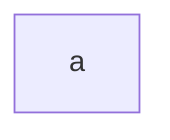

**2: `+`**

`+` is an operator. We can't really do anything with this right now though, since we don't know whats on the right yet. We'll just store it in a different box and wait for the next part.

```typescript
let parsed: Expression<number> = {
    ...
}

let waiting = "+";
```

**2: `b`**

`b` is another variable. There's already a variable in `parsed` and an operator in `waiting`, let's combine these and make a new `Expression`. We have the left and right, `a` and `b`. In the waiting, the operator is `+`. So, we can create a new `Add`!

```typescript
parsed = {
    _tag: "add",
    left: {
        _tag: "leaf",
        val: {
            _tag: "var",
            val: "a",
        }
    },
    right: {
        _tag: "leaf",
        val: {
            _tag: "var",
            val: "b",
        }
    }
}

waiting = null;
```

`parsed` now looks like this


Nice, now we know what we need, one box for the parsed values, and another box for the elements that need more information before they can be parsed. 

The `waiting` box is still a little incomplete. Imagine if the expression was `a + -b` instead. After we put `+` in the waiting, the `-` also needs to be stored somewhere. We could create another box for this, but since `-` is also waiting for more information, let's create a new object `Waiting` and replace the original waiting box to also include negatives:

```typescript
type Operator = "+" | "-" | "*" | "/";

interface Waiting {
    operator: Operator,
    negate: boolean,
}
```

`negate` is a boolean because there are only two options for it: negate or don't negate, so we might as well use a boolean for it.

----------


go a bit more into the `parseInput` function. First, let's decide how we want to do it. I went character by character, and genreated the tree from there. 

My idea is that I have a `waiting` box, where I store things that need more information to be parsed. For example, when I get `+`, I have to wait for the next expression before I can add that to the tree. This can be the object for the waiting:

```typescript
interface Paranned {
    exp: string,
    _tag: "paranned",
}
interface NotParanned {
    exp: string,
    _tag: "not-paranned",
}

type ParanWait = Paranned | NotParanned;

interface Waiting<Operator> {
    operator: Operator | null,
    negate: boolean,
    paran: ParanWait,
}
```

The operator is the operator that needs more before it can be parsed,
The negate is whether or not the next part of the expression has to be negated,
And the paran is for when we are inside the parantheses. In an expression like `1 + (2 * (3 - 4)) + 5`, the expression inside the parantheses gets evaluated separately since we don't want everything to get mixed up.

A "next expected". It's a list which has all the possible types for the next value. If the value doesn't match the expected, an error is thrown. For example, if the value is `+`, `nextExp` gets set to `["number", "variable", "paran", "neg"]`. This will change in each loop when we go character-by-character.

And finally, a `parsed` variable. This is just an `Expression` of whatever has been parsed so far.

Okay! Those are the main elements of the structure, now we can go into the details!

First, let's define the function. It takes a `string` as an input and returns an `Expression<number>`

```typescript
function parseInput(input: string): Expression<number> | null {

}
```
I've added `null` to the return type because the input could just be `""` (empty string).

Now that that's out of the way, lets to adjust the input a tiny bit to make it easier for us. When someone types in `1 + a`, we only need 3 things: `1`, `+`, and `a`. But, if we used `.split("")` on it, we would also get 2 unnecessary spaces. We can use the `replaceAll()` function to get rid of the spaces like so:

```typescript
function parseInput(input: string): Expression<number> | null {
    const splitInp = input.split("");
    const withoutSpaces = splitInp.replaceAll(" ", "");
}
```

This seems like it's ready to go, *but*, there's just one last thing we need to do. If someone types in `10 + a`, the list will look like `["1", "0", "+", "a"]`. Notice how the `10` got split into `1` and `0`? Let's join it together with a new function:

```typescript
function joinSimilars(list: string[], similars: string[]): string[] {
    return list.reduce((prev: string[], current: string) => prev.length === 0
        ? [current]
        : similars.includes(current)
            ? similars.includes(prev[prev.length - 1][0])
                ? [...prev.slice(0, prev.length - 1), prev[prev.length - 1] + current]
                : [...prev, current]
            : [...prev, current],
        []
    )
}
```

It takes in a list that needs to be compressed (`["1", "0", "+", "a"]`, for example), and another list for the "similar" things. For us, the similar things would be `["0", "1", "2", "3", "4", "5", "7", "8", "9"]`. 

`joinSimilars` uses the [`reduce()`](https://developer.mozilla.org/en-US/docs/Web/JavaScript/Reference/Global_Objects/Array/reduce) function to go through each element. It's basically like a for loop, but it has a `previousValue` and a `currentValue`. In our case, if both of them are numbers, the function will join it together.

The part inside the reduce function has a lot of [ternary operator](https://developer.mozilla.org/en-US/docs/Web/JavaScript/Reference/Operators/Conditional_operator) branches, so here is how it is with englished mixed in with the code:
```
if prev.length === 0

    ? [current]

    : if the current value is in the list of similars,

        ? if the similars also includes the value just before this current value,

            ? create a new list with the all of the previous value's elements except the very last one, join the last one and the current value, and put it into the list.

            : just add the current value to the previous value list

        : just add the current value to the previous value list
```

It's a little bit complicated, but all it does is transform an expression like `["1", "0", "+", "a"]` to `["10", "+", "a"]`.

```typescript
function joinSimilars(list: string[], similars: string[]): string[] {
    return list.reduce((prev: string[], current: string) => prev.length === 0
        ? [current]
        : similars.includes(current)
            ? similars.includes(prev[prev.length - 1][0])
                ? [...prev.slice(0, prev.length - 1), prev[prev.length - 1] + current]
                : [...prev, current]
            : [...prev, current],
        []
    )
}

function parseInput(input: string): Expression<number> | null {
    const splitInp = input.split("");
    const withoutSpaces = listed.replaceAll(" ", "");
    const listed = joinSimilars(withoutSpaces, "0123456789".split(""));
}
```

Now to add our 3 main variables:

```typescript
...

type NumberOperator = "+" | "*" | "-" | "/";
type ExpectedVal = "number" | "variable" | "operator" | "paran" | "neg";

function parseInput(input: string): Expression<number> | null {
    ...

    let parsed: Expression<number> | null = null;
    let waiting: Waiting<NumberOperator> = {
        operator: null,
        negate: false,
        paran: {
            _tag: "not-paranned", 
            exp: null
        }
    }
    let nextExp: ExpectedVals[] = ["number", "variable", "paran", "neg"];
}
```

Let's use a `for` loop to go through each character. The first thing we need to do in the for loop is to check if the value is expected, if it isn't then the whole loop has to stop immediately

```typescript
...

function parseInput(input: string): Expression<number> | null {
    ...
    for(let idx = 0; idx < listed.length; idx++) {
        const curVal: string = listed[idx];
        
        if(!isExpected(curVal, nextExp)) {
            throw "Error: Unexpected value"l
        }
    }
}
```

The `isExpected` function just checks if the value is a part of the `nextExp`.

We already know the possible types of characters that come in each loop (neg, number, paran, variable, operator), 


```typescript
export function parseInput(input: string): Expression<number> | null {
    const listed = joinSimilars(input.replaceAll(" ", "").split(""), "1234567890".split(""));

    let parsed: Expression<number> | null = null;
    let waiting: Waiting<NumberOperator> = makeWaiting()
    let nextExp: ExpectedNumVal[] = ["neg", "number", "paran", "variable"];

    for(let idx = 0; idx < listed.length; idx++) {
        const curVal: string = listed[idx];
        if(!isExpected(curVal, nextExp)) {
            throw "Error: Unexpected value";
        } else {
            const shouldCallParan = waiting.paran._tag === "paranned" || curVal === ")" || curVal === "(";

            const newStorage: ParsedWaitNext<number, NumberOperator, ExpectedNumVal> = 
            shouldCallParan 
            ? valueIsOrInParan(parsed, waiting, curVal)
            : curVal === "-" && (waiting.operator !== null || parsed === null)
                ? valueIsNegate(parsed, waiting)
                : (numberOperators as string[]).includes(curVal)
                    ? valueIsOperator(curVal as NumberOperator, parsed as Expression<number>, waiting)
                    : (variables as string[]).includes(curVal) 
                        ? valueIsVar(parsed, waiting, curVal as Variable)
                        : valueIsNumber(JSON.parse(curVal), parsed, waiting);
            
            parsed = newStorage.parsed;
            waiting = newStorage.waiting;
            nextExp = newStorage.next;
        }
    }
    return parsed;
}
```

## Summary

### To-Do list

### Libraries