# **Expression Tree**

## **Table of Contents**
- [**Expression Tree**](#expression-tree)
  - [**Table of Contents**](#table-of-contents)
  - [**Intro**](#intro)
  - [**Order of Operations**](#order-of-operations)
  - [**Properties**](#properties)
    - [**Commutation**](#commutation)
    - [**Association**](#association)
    - [**Distribution**](#distribution)
  - [**Levels/Branches**](#levelsbranches)
  - [**Four modules**](#four-modules)
    - [**Parser**](#parser)
    - [**Orderer**](#orderer)
      - [**Precedence 1**](#precedence-1)
      - [**Precedence 2**](#precedence-2)
      - [**Precedence 3**](#precedence-3)
    - [**Evaluator**](#evaluator)
      - [**Step 1**](#step-1)
      - [**Step 2**](#step-2)
      - [**Step 3**](#step-3)
    - [**Simplifier**](#simplifier)
- [**Code**](#code)
  - [**Parser**](#parser-1)
    - [**Expression Types**](#expression-types)
      - [**Negation**](#negation)
      - [**Parentheses**](#parentheses)
      - [**Leaf**](#leaf)
      - [**Generic Types**](#generic-types)
    - [**The 3 boxes**](#the-3-boxes)
    - [**The parser function**](#the-parser-function)
      - [**Preparing the input**](#preparing-the-input)
      - [**Join Similarities**](#join-similarities)
      - [**Using the boxes**](#using-the-boxes)
      - [**The For Loop**](#the-for-loop)
      - [**Value handlers**](#value-handlers)
  - [**Orderer**](#orderer-1)
    - [**Precedence 1**](#precedence-1-1)
    - [**Precedence 2**](#precedence-2-1)
    - [**Precedence 3**](#precedence-3-1)
    - [**Precedence code**](#precedence-code)
  - [**Evaluator**](#evaluator-1)
  - [**Simplifier**](#simplifier-1)
  - [**Summary**](#summary)
  - [**To-Do list**](#to-do-list)
  - [**Libraries Used**](#libraries-used)
## **Intro**

The expression tree is a structural representation of an expression. Every expression can be shown as a tree. Why does this matter? The tree isn't only a different way of writing an expression, but it's also a *data structure*. Using the tree structure is helpful for computation.

I've divided this article into 2 sections, the first one is about the visualization of the tree, and the second one is about the code. All the code for this project is open-source [on github](github.com/pengvyn/kavpix-code)

The next sections will be showing when and where the tree is useful.

## **Order of Operations**

When looking at an expression like `x + 10 * y`, we know that the first thing to do is `10 * y` and then add `x`, but it isn't obvious. Here's a tree for the same expression:

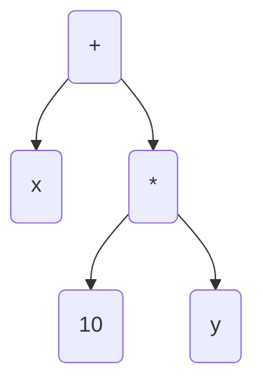

With this tree, we can tell that we do the multiplication first, and the addition second. But with `x + 10 * y`, the most natural thing for people who are used to left-to-right reading is to solve it like `(x + 10) * y`. The tree makes the order in which we have to solve it clear:

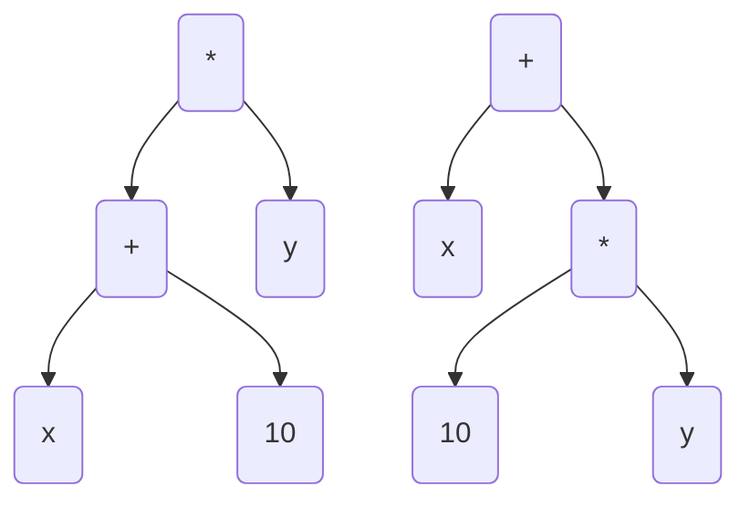

## **Properties**

The properties of operations (commutation, association, distribution) are also easy to visualize with the tree:

### **Commutation**

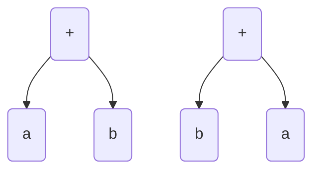

### **Association**

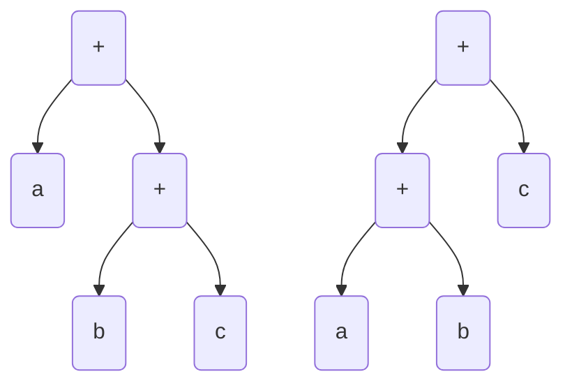

### **Distribution**

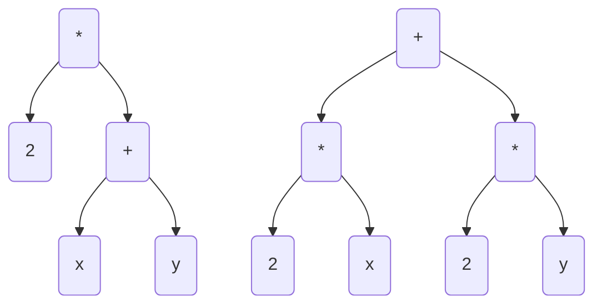

(note: distribution hasn't been implemented in my code [yet](#to-do-list))

## **Levels/Branches**

The one downside to the tree format is that there are always different levels. For example, when adding `1 + a + 3`, it doesn’t matter which 2 numbers you add first, but with the tree you *have* to have an order. So, the tree will look like this:

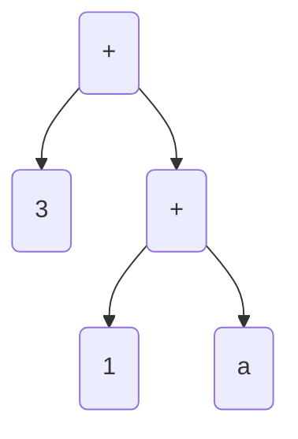

The ideal solution we want is `a + 4`, but in this format, it will first add `1 + a`, which isn't possible since `a` is a variable, and then add `3` to `1 + a`. This will just result in `1 + a + 3` again.

What we want instead is something like this:

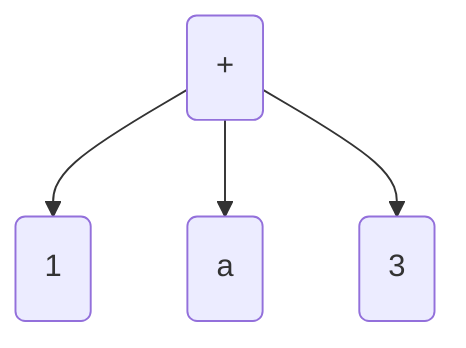

Now, all of them are on the same “level”. Since addition is commutative, we can just re-arrange the expression and add `1` and `3` like so:

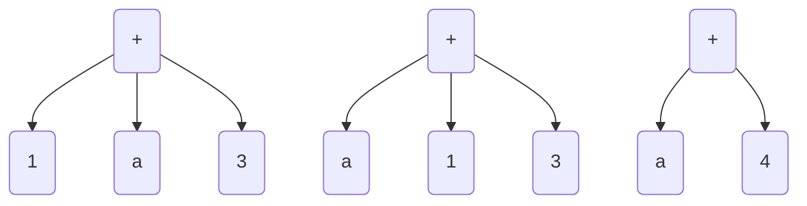

And we’ve got `a + 4`! Perfect!

So, the tree and the textual format are both good for different scenarios, but the tree is helpful when visualizing an expression, and the textual form is good for calculation.

## **Four modules**

I had to write 4 main modules for my code:

1. Parser. It takes the input you type and transforms it into a tree
2. Orderer. Re-arranges the tree to follow the order of operations
3. Evaluator. Takes a tree as input and evaluates/solves it as much as it can.
4. Simplifier. Evaluates the expression even further (more on this later)

Let's see how they work without getting into the actual code part of it. The following bits are very simplified, but if you want the details, make sure to check out the [code](#code-1) section.

### **Parser**

It takes and expression like `a + b * c` and has to convert it into:

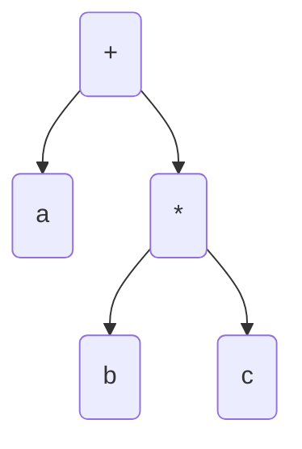

We won't look at the code in this section, but when programming, the tree is needed so that it can understand the input you typed in in.

Here's the process when going character-by-character:

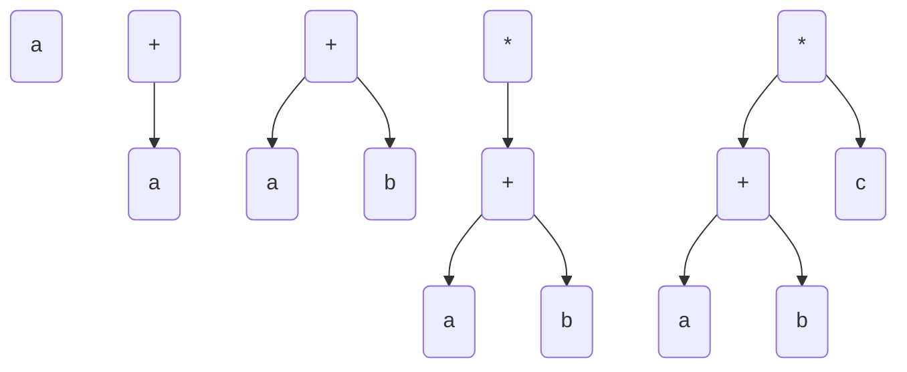

Nice! It's pretty straightforward, it takes the first character, adds it to the tree, then the second, third, etc. 

Although, you might notice that it doesn't follow the operation precedence. Let's take care of that now!

### **Orderer**

Let's use the same example:

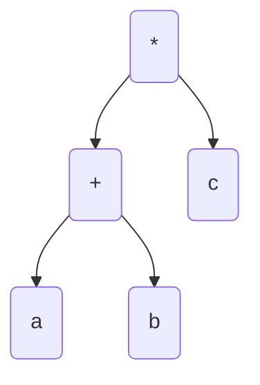

If we add parentheses and translate it back to textual form, it would be `(a + b) * c`. But, what we want is


Which translates to `a + (b * c)`. We need to write a function to do that ordering for us.

With the same example as before, let's look at what exactly we need to do.

There are 3 scenarios in which we need to re-arrange the tree: `a + b * c`, `a * b + c` (normally this one works fine, but we still need to re-arrange it if it ends up like `a * (b + c)`), and `a + b * c + d`. Let's go one by one, starting with `a + b * c`:

#### **Precedence 1**

**Step 1**


The initial tree which we need to change

**Step 2**

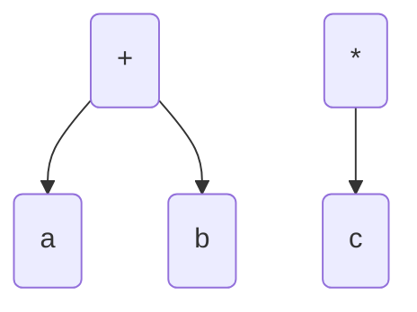

We've now disconnected `mul` from `add`

**Step 3**

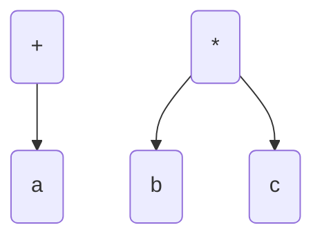

We've given `add`'s `b` to `mul`, and put it in `mul`'s left.

**Step 4**


And finally `add` and `mul` have been joined together again, but this time `mul` is in `add`'s right.

Since multiplication has higher precedence than addition, `b` gets multiplied first.


#### **Precedence 2**

For `a * b + c` (this works if we go left to right, but in the tree it is formatted like `(a * b) + c`)

**Step 1**

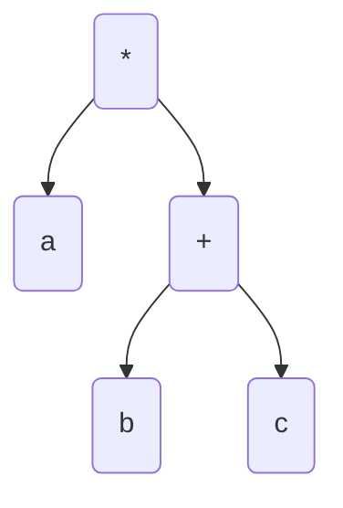

The starting tree

**Step 2**

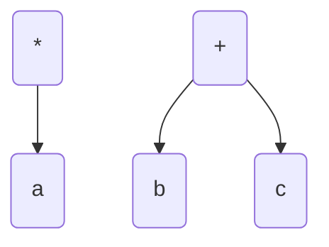

`add` has been split from `mul`

**Step 3**

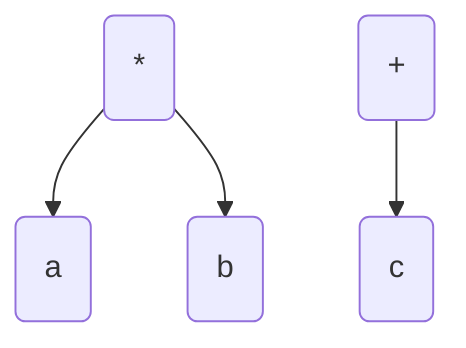

We've given `b` to `mul`'s right from `add`

**Step 4**

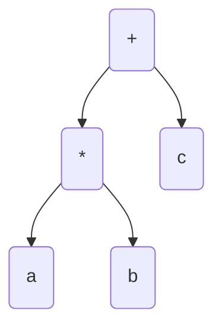

`mul` and `add` have been rejoined. We put `mul` in `add`'s left.

#### **Precedence 3**

For `a + b * c + d`

**Step 1**

```mermaid
    graph TD;
        mul(*) --> add1(+)
        mul(*) --> add2(+)
        add1 --> a(a)
        add1 --> b(b)
        add2 --> c(c)
        add2 --> d(d)
```

Initial tree

**Step 2**

```mermaid
    graph TD;
        mul(*) --> add1(+)
        add1 --> a(a)
        add1 --> b(b)
        add2(+) --> c(c)
        add2 --> d(d)
```

We've removed the `add` on the right side of `mul`

**Step 3**

```mermaid
    graph TD;
        add1(+) --> a(a)
        add1 --> b(b)
        mul(*)
        add2(+) --> c(c)
        add2 --> d(d)
```

We've split the other `add` and `mul`

**Step 4**

```mermaid
    graph TD;
        add1(+) --> a(a)
        mul(*) --> b(b)
        add2(+) --> c(c)
        add2 --> d(d)
```

We've given the left `add`'s `b` to `mul`.

**Step 5**

```mermaid
    graph TD;
        add1(+) --> a(a)
        mul(*) --> b(b)
        mul --> c(c)
        add2(+) --> d(d)
```

We've put `c` in `mul`'s right

**Step 6**

```mermaid
    graph TD;
        add1(+) --> a(a)
        add1(+) --> mul
        mul(*) --> b(b)
        mul --> c(c)
        add2(+) --> d(d)
```

And now we've attached `mul` to the left `add`

**Step 7**

```mermaid
    graph TD;
        add2(+) --> add1
        add2 --> d(d)
        add1(+) --> a(a)
        add1(+) --> mul
        mul(*) --> b(b)
        mul --> c(c)
        
```

For the final step we've attached the left `add` to right `add`.

That's it! That's basically what the orderer does!

### **Evaluator**

The evaluator that *we* use when we're calculating expressions, even if we use it subconsciously. It just calculates as much of the the expression (or tree, in this case) as it can. 

Let's look at the process of the evaluator with a simple example, `5 * 2 + a`. Here's how the tree looks after parsing it:

```mermaid
    graph TD;
        add(+) --> mul(*);
        add --> a(a);
        mul --> 5(5);
        mul --> 2(2);
```

We'll go step by step and see how the evaluator works:

#### **Step 1**

First, it starts with the root, `add`. It knows that there's `a` on the right, but what about the left? The left is an expression: `mul`. It can't evaluate an expression and a number, so it'll evaluate left first, and then use the result to evaluate the whole thing:

#### **Step 2**

It's focusing on *only* the left. So, what it sees is this:

```mermaid
    graph TD;
        mul(*) --> 5(5)
        mul --> 2(2)
```

Okay, this is the information it currently has:

- The left is `5`
- The right is `2`
- The operation is multiplication

That's sufficient information for it to realize that `5` and `2` need to be multiplied! So, it multiplies `5 * 2` and gets `10`! Now, remember how in step 1 it couldn't evaluate and expression and a number? If we give it `10`, it has a number and a number!

#### **Step 3**

It now has some new information: The `mul` on the evaluates to `10`.

And combined with the old information, this is everything it knows:

- The left is `10`
- The right is `a`
- The operation is addition

It has all the information it needs to get the final result: `10 + a`. It can't be evaluated any further, so it's done!

```mermaid
    graph TD;
        add(add) --> 10(10);
        add(add) --> a(a);
```

### **Simplifier**

And last but not least, the simplifier! The evaluator seems like it evaluates everything, *but* there are some instances when it doesn't. That's what the simplifier is for!

Let me give you an example:

```mermaid
    graph TD;
        add(+) --> 10(10);
        add --> add2(+);
        add2 --> a(a);
        add2 --> 5(5);
```

This translates to `10 + a + 5`. The answer we want is `a + 15`, but the evaluator can't do that. Here's the step-by-step process of the evaluator so that we can see why that happens:

1. It looks at the root
    - The left is `10`
    - The right is an `add`
2. It can't evaluate it right now, so it checks if it can evaluate the right
    - The left is `a`
    - The right is `5`
3. It can't add a variable and a number, so it doesn't do anything.
4. Since the left of the root hasn't been updated, it also doesn't do anything

This is the problem here. The evaluator only focuses on *one* branch. When the evaluator is trying to evaluate `a + 5`, it has completely forgotten about the `10`. We could change the evaluator so that it does this, but that might get too complicated so let's just make a simplifier!

What we need to do is bring the branches to the same level. Right now, `add` always has only two branches. If we make it so that it can have more, we can move other branches down or up into one `add`, re-arrange the elements and add them all up. Let's try it out for `10 + a + 5`:

```mermaid
    graph LR;
        subgraph s1[Step 1]

        add(+) --> 10(10);
        add --> add2(+);
        add2 --> a(a);
        add2 --> 5(5);

        end

        subgraph s2[Step 2]

        add3(+) --> 10_2(10);
        add3 --> a2(a);
        add3 --> 5_2(5);

        end

        subgraph s3[Step 3]

        add4(+) --> a3(a);
        add4 --> 10_3(10);
        add4 --> 5_3(5);

        end

        subgraph s4[Step 4]

        add5(+) --> a4(a);
        add5 --> 15(15);

        end

        s1 -.-> s2;
        s2 -.-> s3;
        s3 -.-> s4;
```

And that's all the simplifier does! The good thing about this is that it can bring any number of branches to the same level, not just three.

# **Code**

This section just shows some snippets of the code I wrote, if you want to see the full project (or more), it’s open-source [on github](https://github.com/pengvyn/kavpix-code). All of this code is written in TypeScript, with the help of a [few libraries](#libraries).

There are 4 main modules we need to write for this:

1. Parser. It takes the input you type and transforms it into a tree
2. Orderer. Re-arranges the tree to follow the order of operations
3. Evaluator. Takes a tree as input and evaluates/solves it as much as it can.
4. Simplifier. Evaluates the expression even further (more on this later)

## **Parser**

As mentioned before, it transforms a `string` into a tree. Before we start with the function, let's see how the tree is supposed to look.

### **Expression Types**

First, we can start with a simple expression like `1 + 2`. This is how it looks like as a tree:

```mermaid
    graph TD;
        add(+) --> 1(1);
        add --> 2(2);
```

There are three main things here: `add`, `1`, and `2`. If we generalize this, we get `operation`, `number`, and `number` 

Nice! We now know the three things needed for a tree. An object would be perfect for this

```typescript
type Operation = "add" | "sub" | "mul" | "div";

interface Expression {
    left: number,
    right: number,
    operation: Operation
}
```

Now we have a union type for the operation, the left, and the right. With all of these together we have an `Expression`!

This is good, but for a tree like this:

```mermaid
    graph TD;
        add(+) --> 1(1)
        add(+) --> add2(+)
        add2 --> 2(2)
        add2 --> 3(3)
```

The right isn't a number. it's another `add`.

```typescript
...

interface Expression {
    left: Expression,
    right: Expression,
    operation: Operation,
}
```

That's better! Now we can have an even bigger tree. But, what about negation? It should be included in `Expression` as well, but it only has 1 value, and not left and right.

#### **Negation**

What if we had a bunch of objects, one for each operation, and one more for Negation? Then, we can make `Expression` a union type of all of those!

```typescript
interface Add {
    left: Expression,
    right: Expression,
    operation: "add",
}
interface Sub {
    left: Expression,
    right: Expression,
    operation: "sub",
}
interface Mul {
    left: Expression,
    right: Expression,
    operation: "mul",
}
interface Div {
    left: Expression,
    right: Expression,
    operation: "div",
}
interface Neg {
    val: Expression, // val is short for value
    operation: "neg",
}

type Expression = Add | Sub | Mul | Div | Neg;
```

#### **Parentheses**

Now that negation is here as well, adding parentheses is simple.

```typescript
interface Add {
    left: Expression,
    right: Expression,
    _tag: "add",
}
interface Sub {
    left: Expression,
    right: Expression,
    _tag: "sub",
}
interface Mul {
    left: Expression,
    right: Expression,
    _tag: "mul",
}
interface Div {
    left: Expression,
    right: Expression,
    _tag: "div",
}
interface Neg {
    val: Expression,
    _tag: "neg",
}
interface Group { // (Parentheses)
    val: Expression,
    _tag: "group",
}

type Expression = Add | Sub | Mul | Div | Neg | Group;
```

Now that we've added the `Group` interface to `Expression`, `operation` doesn't really fit, because `(` and `)` aren't operations. So, I changed `operation` to `_tag`. The underscore is just there to easily differentiate it from the other elements in the objects like left, right, or val.

The tag is needed to know which object is which. When a function takes in an expression, it might not know what expression it is. With the tag, we can tell exactly whether it's `Add`, or `Div`, or something else.

#### **Leaf**

We're almost done with the types, there's just one more `interface` needed. None of the `interface`s have numbers or variables. It's always an expression. This means that adding a number or variable to the tree would give a type error. Let's fix that!

```typescript
...

const _variables = ["a", "b", "c", "d", "e", "f", "g", "h", "i", "j", "k", "l", "m", "n", "o", "p", "q", "r", "s", "t", "u", "v", "w", "x", "y", "z"] as const;
type Variable = typeof _variables[number];

interface VarLeaf { // short for Variable Leaf
    val: Variable,
    _tag: "var",
}
interface ValLeaf { // short for Value Leaf
    val: number,
    _tag: "val"
}
interface Leaf {
    val: VarLeaf | ValLeaf,
    _tag: "leaf"
}

type Expression = Add | Sub | Mul | Div | Neg | Group | Leaf  | VarLeaf | ValLeaf;
```

We've now made 3 new objects: `VarLeaf`, `ValLeaf`, and `Leaf`. With this structure, we have numbers, variables, expressions, and expressions inside of expressions! Awesome!

`as const` sets the type of `_variables` to `["a", "b", "c", ... "y", "z"]`. By default, `_variables` is a `string`, but after using `as const`, `_variables` is *only* a list of the lower-case letters.

```typescript
type Variable = typeof _variables[number];
```

Translates to:

```typescript
type Variable = "a" | "b" | "c" | ... "y" | "z";
```

The names `ValLeaf` and `VarLeaf` are a little bit confusing, but it isn't too hard to get the hang of it.

You might be wondering why `ValLeaf` wasn't named something like `NumLeaf`. Even if you weren't, it's because all of the types will be generalized. They don't have to be used only for numbers and variables, but also for other things. Calling it `NumLeaf` means it only applies to numbers, which it doesn't.

#### **Generic Types**

Speaking of generalization, we can use *generic types* for all the objects.

A generic type is like an "input" to a type.

```typescript
interface ValLeaf<T> {
    val: T,
    _tag: "val"
}
```

Here, `T` is the input type. If we want to use numbers, we would write `ValLeaf<number>`. Or maybe we want to use a list of numbers, then it would be `ValLeaf<number[]>`.

Let's generalize all the previous types:

```typescript
interface Add<T> {
    left: Expression<T>,
    right: Expression<T>,
    _tag: "add"
}

...

interface VarLeaf {
    val: Variable,
    _tag: "var"
}
interface ValLeaf<T> {
    val: T,
    _tag: "val"
}
interface Leaf<T> {
    val: VarLeaf | ValLeaf<T>,
    _tag: "leaf"
}

type Expression<T> = Add<T> | Sub<T> | ... ;
```

And we're finished with `Expression`! We can finally move on

### **The 3 boxes**

Okay, now that we've got the expression itself taken care of, we can go a bit deeper into the writing the function. Although, we aren't done with types just yet. For our parser, one method to use is to go character-by-character, which means we use the `.split()` function for the input string, and go from there.

Let's look at an example for `a + b`, and try to see what information we need to store in boxes (`let`s) in each cycle:

**Character 1: `a`**

`a` is a variable. Remember how we added `VarLeaf` to `Expression`? That means it's an expression on it's own. We need somewhere to store `a`, so let's create our first box, `parsed`:

```typescript
let parsed: Expression<number> = {
    _tag: "leaf",
    val: {
        _tag: "var",
        val: "a"
    }
}
```

Here's how `parsed` looks so far:

```mermaid
    graph TD;
        a(a);
```

**Character 2: `+`**

`+` is an operator. We can't really do anything with this right now though, since we don't know whats on the right yet. We'll just create our second box to store things like operators which need more information before it can be parsed. Let's call it `waiting`.

```typescript
let parsed: Expression<number> = {
    ...
}

let waiting = "+";
```

**Character 3: `b`**

`b` is another variable. There's already a variable in `parsed` and an operator in `waiting`, let's combine these and make a new `Expression`. We have the left and right, `a` and `b`. The operator inside `waiting` is `+`. So, we can create a new `Add`!

```typescript
parsed = {
    _tag: "add",
    left: {
        _tag: "leaf",
        val: {
            _tag: "var",
            val: "a",
        }
    },
    right: {
        _tag: "leaf",
        val: {
            _tag: "var",
            val: "b",
        }
    }
}

waiting = null;
```

`parsed` now looks like this:

```mermaid
    graph TD;
        add(+) --> a(a);
        add --> b(b);
```

Nice, now we know what we need, one box for the parsed values, and another box for the elements that need more information before they can be parsed. 

The `waiting` box is still a little incomplete. Imagine if the expression was `a + -b` instead. After we put `+` in the waiting, the `-` also needs to be stored somewhere. We could create another box for this, but since `-` is also waiting for more information, let's add a new element to our `Waiting` object:

```typescript
interface Waiting<Operator> {
    operator: Operator,
    negate: boolean,
}
```

`negate` is a `boolean` because there are only two options for it: negate or don't negate.

The example we used before is pretty simple, but what about something like `a + (b * c)`?

The parentheses makes everything a lot more complicated, but one nice method is to just keep `b * c` stored in the `waiting` `let` as a `string`, and then parse that bit separately by calling our parser again. Let's add another element to the `Waiting` object:

```typescript
interface Grouped {
    _tag: "grouped",
    exp: string,
}
interface UnGrouped {
    _tag: "ungrouped",
    exp: null,
}
type GroupWait = Grouped | UnGrouped;

interface Waiting {
    operator: Operator,
    negate: boolean,
    group: GroupWait,
}
```

Perfect!

We have two boxes, but what about the third one? The `parsed` and `waiting` boxes seem like enough, but there's just one more box we need. Imagine if someone makes a typo and types `a ++ b` instead of `a + b`. We can't parse that. After `+`, we're *expecting* either parentheses, a negative sign, or a variable/number. We need to send an error for that. Let's create a box for what we expect, and if the character doesn't match out expectations, we throw an error.

```typescript
type ExpectedNum = "number" | "variable" | "operator" | "neg" | "group";
```

The `ExpectedNum` has all the things we could expect. We can just make a list of `ExpectedNum`s for our third and final box, `nextExpected`!

```typescript
let nextExp: ExpectedNum[] = [...] // the expectations in each cycle
```

Now that we officially have 3 boxes, let's make the parser!

### **The parser function**

Let's start out by defining the function:

```typescript
function parseInput(input: string): Expression<number> | null {

}
```
The return type could be `null` if the input is `""` (empty string).

#### **Preparing the input**

Before we add our 3 boxes into the function, let's tweak the input a tiny bit to make it easier for us. Since we're going character by character, we can use the `.split("")` function to make the string into a list. 

But, when someone types in `1 + a`, we only need 3 things: `1`, `+`, and `a`. When we use split, we get `["1", " ", "+", " ", "a"]`. All of those spaces are not needed, so let's just get rid of it using `.replaceAll()`:

```typescript
function parseInput(input: string): Expression<number> | null {
    const withoutSpaces = input.replaceAll(" ", "");
    const splitInp = withoutSpaces.split("");
}
```

All the unnecessary spaces have been removed! But, if someone types in an expression with a 2 digit number, like `10 + a`, it will result in `["1", "0", "+", "a"]`. But we don't want `["1", "0", ...]`, we want `["10", ...]`. Let's write a new function to join them together:

#### **Join Similarities**

```typescript
function joinSimilarities(list: string[], similarities: string[]): string[] {
    return list.reduce((prev: string[], current: string) => prev.length === 0
        ? [current]
        : similarities.includes(current)
            ? similarities.includes(prev[prev.length - 1][0])
                ? [...prev.slice(0, prev.length - 1), prev[prev.length - 1] + current]
                : [...prev, current]
            : [...prev, current],
        []
    )
}
```

It takes in a list that needs to be compressed (`["1", "0", "+", "a"]`, for example), and another list for the "similar" things. For us, the similar things would be `["0", "1", "2", "3", "4", "5", "7", "8", "9"]`. 

`joinSimilarities` uses the [`reduce()`](https://developer.mozilla.org/en-US/docs/Web/JavaScript/Reference/Global_Objects/Array/reduce) function to go through each element. It's basically like a for loop, but it has a `previousValue` and a `currentValue`. In our case, if both of them are numbers, the function will join it together.

The part inside the reduce function has a lot of [ternary operator](https://developer.mozilla.org/en-US/docs/Web/JavaScript/Reference/Operators/Conditional_operator) branches, so here is how it is with english mixed in with the code:
```
if prev.length === 0

    ? [current]

    : if the current value is in the list of similarities,

        ? if the similarities also includes the value just before this current value,

            ? create a new list with the all of the previous value's elements except the very last one, join the last one and the current value, and put it into the list.

            : just add the current value to the previous value list

        : just add the current value to the previous value list
```

It's a little bit complicated, but all it does is transform an expression like `["1", "0", "+", "a"]` to `["10", "+", "a"]`.

And with everything put together, the code looks like this:

```typescript
function joinSimilarities(list: string[], similarities: string[]): string[] {
    return list.reduce((prev: string[], current: string) => prev.length === 0
        ? [current]
        : similarities.includes(current)
            ? similarities.includes(prev[prev.length - 1][0])
                ? [...prev.slice(0, prev.length - 1), prev[prev.length - 1] + current]
                : [...prev, current]
            : [...prev, current],
        []
    )
}

function parseInput(input: string): Expression<number> | null {
    const splitInp = input.split("");
    const withoutSpaces = listed.replaceAll(" ", "");
    const listed = joinSimilarities(withoutSpaces, "0123456789".split(""));
}
```

#### **Using the boxes**

Now that the input is ready to go, it's time to add the boxes we made earlier!

```typescript
...

type NumberOperator = "+" | "*" | "-" | "/";
type ExpectedValue = "number" | "variable" | "operator" | "group" | "neg";

function parseInput(input: string): Expression<number> | null {
    ...

    let parsed: Expression<number> | null = null;
    let waiting: Waiting<NumberOperator> = {
        operator: null,
        negate: false,
        group: {
            _tag: "ungrouped", 
            exp: null
        }
    }
    let nextExp: ExpectedValue[] = ["number", "variable", "group", "neg"];
}
```

Since all of that is out of the way, let's start with the loop!

#### **The For Loop**

Let's use a `for` loop to go through each character. The first thing we need to do in the `for` loop is to check if the value is expected, if it isn't then the whole loop has to stop immediately.

```typescript
...

function parseInput(input: string): Expression<number> | null {
    ...
    for(let idx = 0; idx < listed.length; idx++) {
        const curVal: string = listed[idx];
        
        if(!isExpected(curVal, nextExp)) {
            throw "Error: Unexpected value"l
        }
    }
}
```

The `isExpected` function just checks if the value is a part of the `nextExp`.

We already know the possible types of characters that come in each loop (neg, number, group, variable, operator), so we can use `if` to decide what to do. Before we actually make it do anything, let's plan out the structure:


```typescript
...

type NumberOperator = "+" | "-" | "*" | "/";
const numberOperators = ["+", "-", "*", "/"];

...

const numberOperators: NumberOperator[] = ["+"]

function parseInput(input: string): Expression<number> | null {
    ...
    for(let idx = 0; idx < listed.length; idx++) {
        const curVal: string = listed[idx];
        
        if(!isExpected(curVal, nextExp)) {
            throw "Error: Unexpected value"l
        }

        const shouldHandleGroup = waiting.group._tag === "grouped" || curVal === "(" || curVal === ")";

        if(shouldHandleGroup) {

        }

        const shouldHandleNeg = curVal === "-" && (waiting.operator !== null || parsed === null);
        // if waiting.operator is null, and parsed is not null, it means that curVal is for subtraction and not negation.

        if(shouldHandleNeg) {

        }

        if((numberOperators as string[]).includes(curVal)) { // if curVal is an operator

        }

        if((variables as string[]).includes(curVal)) {

        }
        
        // if none of the above, curVal is a number.
    }
    return parsed;
}
```

Instead of actually handling each one of those inside the `if` block, let's create functions to handle them, and call those function inside the `if`s.

#### **Value handlers**

Each of the functions will do some of these 3 things:

- Update `parsed`
- Update `waiting`
- Update `nextExpected`

First, the number handler!

```typescript
interface ParsedWaitNext<T, Op, NE> {
    parsed: Expression<T>,
    waiting: Waiting<Op>,
    next: NE[],
}

function valueIsNumber(
    value: number, 
    parsed: Expression<number> | null, 
    waiting: Waiting<NumberOperator>
): ParsedWaitNext<number, NumberOperator, ExpectedValue> {
    if(waiting.negate) {

    }
}
```

The `ParsedWaitNext` interface is needed because we need our main `parseInput` function to get all the 3.

We've stopped here because we are going to be changing `parsed` a lot. It's pretty tiring to keep typing all the curly braces over and over, so why don't we just make a function that does it for us?

```typescript
function makeNumExp(
    leftOrValue: Expression<number>,
    right: Expression<number> | null,
    tag: NumberOperator | "neg" | "group",
): Expression<number> {
    ...
}

function makeLeaf(val: T | Variable): Leaf<T> {
    ...
}
```

If you want to check out the contents of the functions, click [here]() to see it on github.

`makeLeaf` is pretty straightforward, it takes a `T` or a `Variable`, makes a `VarLeaf` or a `ValLeaf<T>` from it, and then puts that into a `Leaf`.

`makeNumExp` takes a left, right, and a tag. If `tag` is `"neg"` or `"group"`, the left is the value and right is `null`. All it does is create a new `Expression` with the inputs. For example,

```typescript
const exp = makeNumExp(
    {
        _tag: "leaf",
        val: {
            _tag: "var",
            val: "a",
        }
    },
    {
        _tag: "leaf",
        val: {
            _tag: "var",
            val: "b",
        }
    },
    "*"
)

const result = {
    _tag: "mul",
    left: {
        _tag: "leaf",
        val: {
            _tag: "var",
            val: "a",
        }
    },
    right: {
        _tag: "leaf",
        val: {
            _tag: "var",
            val: "b",
        }
    }
}
```

`exp` and `result` are equal.

And now, to pick up where we left off:

```typescript
function valueIsNumber(
    value: number, 
    parsed: Expression<number> | null, 
    waiting: Waiting<NumberOperator>
): ParsedWaitNext<number, NumberOperator, ExpectedValue> {
    if(waiting.negate) {

    }
}
```

Let's use `makeNumExp`!

```typescript
function valueIsNumber(
    value: number, 
    parsed: Expression<number> | null, 
    waiting: Waiting<NumberOperator>
): ParsedWaitNext<number, NumberOperator, ExpectedValue> {
    const leafed = makeLeaf(value);

    const newBranch: Expression<number> = waiting.negate
        ? makeNumExp(leafed, null, "neg")
        : value
    
    const newParsed: Expression<number> = parsed === null
        ? newBranch
        : makeNumExp(parsed, newBranch, waiting.operator as NumberOperator)

    const newNext: ExpectedValue[] = ["operator", "group"];
    const newWaiting: Waiting<NumberOperator> = {
        operator: null,
        negate: false,
        group: {
            _tag: "ungrouped",
            exp: null,
        }
    }
    return {
        parsed: newParsed,
        waiting: newWaiting,
        next: newNext,
    }
}
```

What the code above is doing is, first it checks if `waiting.negate` is `true`. If it is, it means `value` needs to be negated, so it makes a new `Neg` for the value. If `waiting.negate` is `false`, it just sets the value as the branch.

Then, for the parsed, if `parsed` is `null`, it means that this number is the first part of the expression. Which means nothing needs to be done, so `newParsed` gets set to `newBranch`. If it isn't `null`, though, `parsed` and `newBranch` need to be combined using the operator in `waiting`.

The next expected from here is only `["operator", "group"]`. Other than an operator, or a `)` (closed parentheses), nothing else can come after a number.

`newWaiting` is just the default `Waiting`. 


Now let's write a `valueIsVariable` function.

```typescript
function valueIsVariable(
    value: Variable, 
    parsed: Expression<number> | null, 
    waiting: Waiting<NumberOperator>
): ParsedWaitNext<number, NumberOperator, ExpectedValue> {
    const leafed = makeLeaf(value);

    const newBranch: Expression<number> = waiting.negate
        ? makeNumExp(leafed, null, "neg")
        : value
    
    const newParsed: Expression<number> = parsed === null
        ? newBranch
        : makeNumExp(parsed, newBranch, waiting.operator as NumberOperator)

    const newNext: ExpectedValue[] = ["operator"];
    const newWaiting: Waiting<NumberOperator> = {
        operator: null,
        negate: false,
        group: {
            _tag: "ungrouped",
            exp: null,
        }
    }
    return {
        parsed: newParsed,
        waiting: newWaiting,
        next: newNext,
    }
}
```

The `valueIsVariable` and `valueIsNumber` functions are exactly the same, except for in the 2nd line:

```typescript
function valueIsVariable(
    value: Variable, // <-- number or Variable
    parsed: Expression<number> | null,
    
    ...
```

So, why don't we just combine them?

```typescript
function valueIsNumOrVar(
    value: number | Variable, 
    parsed: Expression<number> | null, 
    waiting: Waiting<NumberOperator>
): ParsedWaitNext<number, NumberOperator, ExpectedValue> {

    ...

```
Awesome! Let's see how this looks when implemented in `parseInput`.

```typescript
function valueIsNumOrVar(
    value: number | Variable, 
    parsed: Expression<number> | null, 
    waiting: Waiting<NumberOperator>
): ParsedWaitNext<number, NumberOperator, ExpectedValue> {
    const leafed = makeLeaf(value);

    const newBranch: Expression<number> = waiting.negate
        ? makeNumExp(leafed, null, "neg")
        : value
    
    const newParsed: Expression<number> = parsed === null
        ? newBranch
        : makeNumExp(parsed, newBranch, waiting.operator as NumberOperator)

    const newNext: ExpectedValue[] = ["operator"];
    const newWaiting: Waiting<NumberOperator> = {
        operator: null,
        negate: false,
        group: {
            _tag: "ungrouped",
            exp: null,
        }
    }
    return {
        parsed: newParsed,
        waiting: newWaiting,
        next: newNext,
    }
}

function parseInput(input: string): Expression<number> | null {
    const splitInp = input.split("");
    const withoutSpaces = listed.replaceAll(" ", "");
    const listed = joinSimilarities(withoutSpaces, "0123456789".split(""));

    let parsed: Expression<number> | null = null;
    let waiting: Waiting<NumberOperator> = {
        operator: null,
        negate: false,
        group: {
            _tag: "ungrouped", 
            exp: null
        }
    }
    let nextExp: ExpectedValue[] = ["number", "variable", "group", "neg"];

    for(let idx = 0; idx < listed.length; idx++) {
        const curVal: string = listed[idx];
        
        if(!isExpected(curVal, nextExp)) {
            throw "Error: Unexpected value"l
        }

        const shouldHandleGroup = waiting.group._tag === "grouped" || curVal === "(" || curVal === ")";

        const shouldHandleNeg = curVal === "-" && (waiting.operator !== null || parsed === null);

        const pwn: ParsedWaitNext< ... > = shouldHandleGroup
            ? // valueIsGroup()
            : shouldHandleNeg
                ? // valueIsNeg()
                : (numberOperators as string[]).includes(curVal)
                    ? // valueIsOperator()
                    : valueIsNumOrVar(
                        (variables as string[]).includes(curVal)
                            ? curVal
                            : JSON.parse(curVal) // converts a string like "10" into the actual number 10
                        parsed,
                        waiting
                    )
        
        parsed = pwn.parsed;
        waiting = pwn.waiting;
        nextExp = pwn.next;
    }
    return parsed;
}
```

The `if`s have also been changed to ternary operators since it looks more compact now. `curVal` is always a string, so I had to use `JSON.parse()` to make it a number.

Everything's looking pretty good so far! 3 more handler functions to go!

Let's write the `valueIsNeg()` function, it shouldn't be too complicated.

```typescript
function valueIsNeg(
    parsed: Expression<number> | null, 
    waiting: Waiting<NumberOperator>
    ): ParsedWaitNext<number, NumberOperator, ExpectedNumVal> {
        const newWaiting: Waiting<NumberOperator> = {...waiting, negate: true};
        const nextExp: ExpectedNumVal[] = ["number", "group", "variable"];
        return {parsed, waiting: newWaiting, next: nextExp};
}
```

Since `parsed` doesn't change, all that needs to happen is to set `waiting.negate` to `true` and update `nextExp`.

And now `valueIsOperator()`:

```typescript
export function valueIsOperator(
    value: NumberOperator, 
    parsed: Expression<number>, 
    waiting: Waiting<NumberOperator>
    ): ParsedWaitNext<number, NumberOperator, ExpectedNumVal> {
        const newWaiting: Waiting<NumberOperator> = {...waiting, operator: value};
        const nextExp: ExpectedNumVal[] = ["neg", "number", "group", "variable"];
        return {parsed, waiting: newWaiting, next: nextExp};
}
```

Again, nothing complex since we just had to put the operator in `waiting`.

Finally, `valueIsGroup()`. This one *is* a bit complicated, though.

There are many things that could happen. The value could be `(`, or `)`. Actually, it could also be anything else. If `waiting.group._tag` is `grouped`, it means the value needs to be added into `waiting.group.exp`. If the value is `)`, it means we have to parse `waiting.group.exp`, and combine that with our original `parsed`. 

But that's not all, what about nested parentheses? An expression like `a + (b * (c - d))` will result in, `b * (c - d` being added into `waiting.group.exp`, and then it'll stop after `d` because of the closing parentheses. We don't want this though, we want `b * (c - d)` to be added, and stop after that.

Let's take care of the nested parentheses problem. What we need is an *extra* closing parentheses. In `b * (c - d)`, the number of closing parentheses is the same as the number of opening parentheses. But, with `b * (c - d))`, We have an extra closing parentheses! This means we can stop now, parse the expression, and add it to `parsed`. 

Okay, we need to write a function that checks if there are more of `)` than `(`.

```typescript
function shouldParseGroup(exp: string): boolean {
    const listed = exp.split("");

    const openParentheses = listed.filter((c) => c === "(");
    const closedParentheses = listed.filter((c) => c === ")");

    return closedParentheses.length > openParentheses.length;
}
```

What this function does is it filters out all of the `(`s from the expression, and all of the `)`s, then sees which one has more. If there are more `)`s, it returns true, meaning we have to parse the expression. If it returns false, we add it to `waiting.group.exp`.

```typescript
function valueIsOrInGroup(
    parsed: Expression<number> | null,
    waiting: Waiting<NumberOperator>,
    value: string
): ParsedWaitNext<number, NumberOperator, ExpectedNumVal> {
    if(value === ")") {
        // if closed parentheses
    } else if(waiting.group._tag === "grouped") {
        // if _tag is "grouped" then it can't be open parentheses
        // (unless it's nested)
    } else {
        // open parentheses
    }
}
```

Since there are 3 options here, let's just create 3 more functions: `valueIsClosedGroup`, `valueIsOpenGroup`, and `valueIsInGroup`.

For `valueIsInGroup`, the only things we need to do is add the value to `waiting.group.exp` and update `nextExp`. Easy!

```typescript
function valueIsInGroup(
    parsed: Expression<number> | null,
    waiting: Waiting<NumberOperator>,
    value: string
): ParsedWaitNext<number, NumberOperator, ExpectedNumVal> {
    return {
        parsed,
        waiting: {
            ...waiting, 
            group: {
                ...waiting.group,
                exp: waiting.group.exp + value,
            }
        },
        next: ["neg", "number", "group", "operator", "variable"]
    }
}
```

`valueIsOpenParentheses()` is also pretty easy:

```typescript
function valueIsOpenParentheses(
    parsed: Expression<number> | null,
    waiting: Waiting<NumberOperator>
): ParsedWaitNext<number, NumberOperator, ExpectedNumVal> {
    return {
        parsed,
        waiting: {
            ...waiting,
            group: {_tag: "grouped", exp: ""}
        },
        next: ["neg", "number", "variable", "group"]
    }
}
```

And finally, `valueIsClosedParentheses()`:

```typescript
function shouldParseGroup(exp: string): boolean {
    const listed = exp.split("");

    const openParentheses = listed.filter((c) => c === "(");
    const closedParentheses = listed.filter((c) => c === ")");

    return closedParentheses.length > openParentheses.length;
}

function valueIsClosedParentheses(
    parsed: Expression<number> | null,
    waiting: Waiting<NumberOperator>
): ParsedWaitNext<number, NumberOperator, ExpectedNumVal> {
    const exp = waiting.group.exp;

    if(shouldParseGroup(exp)) {
        const parsedExpNoNeg = parseInput(exp);
        const parsedExp = waiting.negate 
            ? makeNumExp(parsedExpNoNeg, null, "neg") 
            : parsedExpNoNeg
        return {
            parsed: parsed === null
                ? parsedExp
                : makeNumExp(parsed, parsedExp, waiting.operator),
            waiting: {operator: null, group: {_tag: "ungrouped", exp: null}},
            next: ["operator", "group"]
        }
    }
    return {
        parsed,
        waiting: {
            ...waiting,
            group: {
                _tag: "grouped",
                exp: exp + ")"
            }
        },
        next: ["operator", "group"]
    }
}
```

First, the function checks if the expression has to be parsed using the function we made before.

If it does have to be parsed, it calls, `parseInput()` and parses it. It negates it if needed, and then combines it with `parsed`, if `parsed` isn't null. 

If it doesn't have to be parsed, it does the same thing `valueIsInGroup()` does.

Okay! It's time to put all of them into `valueIsOrInGroup`!

```typescript
function valueIsInGroup(
    parsed: Expression<number> | null,
    waiting: Waiting<NumberOperator>,
    value: string
): ParsedWaitNext<number, NumberOperator, ExpectedNumVal> {
    return {
        parsed,
        waiting: {
            ...waiting, 
            group: {
                ...waiting.group,
                exp: waiting.group.exp + value,
            }
        },
        next: ["neg", "number", "group", "operator", "variable"]
    }
}
function valueIsOpenParentheses(
    parsed: Expression<number> | null,
    waiting: Waiting<NumberOperator>
): ParsedWaitNext<number, NumberOperator, ExpectedNumVal> {
    return {
        parsed,
        waiting: {
            ...waiting,
            group: {_tag: "grouped", exp: ""}
        },
        next: ["neg", "number", "variable", "group"]
    }
}

function shouldParseGroup(exp: string): boolean {
    const listed = exp.split("");

    const openParentheses = listed.filter((c) => c === "(");
    const closedParentheses = listed.filter((c) => c === ")");

    return closedParentheses.length > openParentheses.length;
}

function valueIsClosedParentheses(
    parsed: Expression<number> | null,
    waiting: Waiting<NumberOperator>
): ParsedWaitNext<number, NumberOperator, ExpectedNumVal> {
    const exp = waiting.group.exp;

    if(shouldParseGroup(exp)) {
        const parsedExpNoNeg = parseInput(exp);
        const parsedExp = waiting.negate 
            ? makeNumExp(parsedExpNoNeg, null, "neg") 
            : parsedExpNoNeg
        return {
            parsed: parsed === null
                ? parsedExp
                : makeNumExp(parsed, parsedExp, waiting.operator),
            waiting: {operator: null, group: {_tag: "ungrouped", exp: null}},
            next: ["operator", "group"]
        }
    }
    return {
        parsed,
        waiting: {
            ...waiting,
            group: {
                _tag: "grouped",
                exp: exp + ")"
            }
        },
        next: ["operator", "group"]
    }
}

function valueIsOrInGroup(
    parsed: Expression<number> | null,
    waiting: Waiting<NumberOperator>,
    value: string
): ParsedWaitNext<number, NumberOperator, ExpectedNumVal> {
    let pwn;
    if(value === ")") {
       pwn = valueIsClosedParentheses(parsed, waiting);
    } else if(waiting.group._tag === "grouped") {
        pwn = valueIsInGroup(parsed, waiting, value);
    } else {
        pwn = valueIsOpenParentheses(parsed, waiting);
    }
    return pwn;
}
```

And here's how `parseInput()` looks with all the new functions added into it:

```typescript

function parseInput(input: string): Expression<number> | null {
    const splitInp = input.split("");
    const withoutSpaces = listed.replaceAll(" ", "");
    const listed = joinSimilarities(withoutSpaces, "0123456789".split(""));

    let parsed: Expression<number> | null = null;
    let waiting: Waiting<NumberOperator> = {
        operator: null,
        negate: false,
        group: {
            _tag: "ungrouped", 
            exp: null
        }
    }
    let nextExp: ExpectedValue[] = ["number", "variable", "group", "neg"];

    for(let idx = 0; idx < listed.length; idx++) {
        const curVal: string = listed[idx];
        
        if(!isExpected(curVal, nextExp)) {
            throw "Error: Unexpected value"l
        }

        const shouldHandleGroup = waiting.group._tag === "grouped" || curVal === "(" || curVal === ")";

        const shouldHandleNeg = curVal === "-" && (waiting.operator !== null || parsed === null);

        const pwn: ParsedWaitNext< ... > = shouldHandleGroup
            ? valueIsOrInGroup(parsed, waiting, curVal)
            : shouldHandleNeg
                ? valueIsNeg(parsed, waiting)
                : (numberOperators as string[]).includes(curVal)
                    ? valueIsOperator(parsed, waiting, curVal)
                    : valueIsNumOrVar(
                        (variables as string[]).includes(curVal)
                            ? curVal
                            : JSON.parse(curVal)
                        parsed,
                        waiting
                    )
        
        parsed = pwn.parsed;
        waiting = pwn.waiting;
        nextExp = pwn.next;
    }
    return parsed;
}
```

Awesome! We've finally finished our parser!!

## **Orderer**

We already went through this in a [previous section](#orderer), but, to recap, we went through 3 scenarios where we'll need to re-arrange the tree when it doesn't follow the order of operations. Let's quickly look at the process again:

### **Precedence 1**

For the `a + b * c`.

**Step 1**

```mermaid
    graph TD;
        mul(*) --> add(+);
        mul --> c(c);
        add --> a(a);
        add --> b(b);
```

**Step 2**

```mermaid
    graph TD;
        add(+) --> a(a);
        add --> b(b);
        mul(*) --> c(c);
```

**Step 3**

```mermaid
    graph TD;
        add(+) --> a(a);
        mul(*) --> b(b);
        mul --> c(c);
```
**Step 4**

```mermaid
    graph TD;
        add(+) --> a(a);
        add --> mul(*);
        mul --> b(b);
        mul --> c(c);
```

Let's translate this into words, it will help us a bunch when we're writing the code:

1. Remove the `left` from the root.
2. Take the `right` of the `left`, and attach it to the `left` of the root.
3. Attach the root to the `right` of the `left`.

(This is very hard to follow, but it's easier with the images as reference)

### **Precedence 2**

For `a * b + c`.

**Step 1**

```mermaid
    graph TD;
        mul(*) --> a(a)
        add(+) --> b(b)
        add --> c(c)
        mul --> add
```

**Step 2**

```mermaid
    graph TD;
        mul(*) --> a(a)
        add(+) --> b(b)
        add --> c(c)
```

**Step 3**

```mermaid
    graph TD;
        mul(*) --> a(a)
        mul(*) --> b(b)
        add(+) --> c(c)
```

**Step 4**

```mermaid
    graph TD;
        mul(*) --> a(a)
        mul(*) --> b(b)
        add(+) --> mul
        add --> c(c)
```

Again, in words:

1. Remove `right` from the root
2. Take the `left` from `right` and attach it to the `right` of the `root`
3. Attach the root to the `left` of `right`


### **Precedence 3**

For `a + b * c + d`

**Step 1**

```mermaid
    graph TD;
        mul(*) --> add1(+)
        mul(*) --> add2(+)
        add1 --> a(a)
        add1 --> b(b)
        add2 --> c(c)
        add2 --> d(d)
```

**Step 2**

```mermaid
    graph TD;
        mul(*) --> add1(+)
        add1 --> a(a)
        add1 --> b(b)
        add2(+) --> c(c)
        add2 --> d(d)
```

**Step 3**

```mermaid
    graph TD;
        add1(+) --> a(a)
        add1 --> b(b)
        mul(*)
        add2(+) --> c(c)
        add2 --> d(d)
```

**Step 4**

```mermaid
    graph TD;
        add1(+) --> a(a)
        mul(*) --> b(b)
        add2(+) --> c(c)
        add2 --> d(d)
```

**Step 5**

```mermaid
    graph TD;
        add1(+) --> a(a)
        mul(*) --> b(b)
        mul --> c(c)
        add2(+) --> d(d)
```

**Step 6**

```mermaid
    graph TD;
        add1(+) --> a(a)
        add1(+) --> mul
        mul(*) --> b(b)
        mul --> c(c)
        add2(+) --> d(d)
```

**Step 7**

```mermaid
    graph TD;
        add2(+) --> add1
        add2 --> d(d)
        add1(+) --> a(a)
        add1(+) --> mul
        mul(*) --> b(b)
        mul --> c(c)     
```

And the final one:

1. Remove `left` from the root
2. Remove `right` from the root
3. Attach `left`'s `right` to the root's `left`
4. Attach `right`'s `left` to the root's `right`
5. Attach the root to the `left`'s `right`
6. Attach `left` to `right`'s `left`

The text for this example is very hard to follow, but if you look at it and the trees together it's a little easier. It's the kind of thing that's seems simple until you write it down. But, we've got the 3 precedences generalized with the words. We can apply this to our code now!

### **Precedence code**

Why don't we use recursion to re-arrange everything into order? We first re-arrange the left, then the right, and then we put the new left and right back together and re-arrange the whole thing!

But before that, we don't want to re-arrange anything that isn't `mul` or `div`, since they are the highest in precedence. There's `group`, too, but we don't re-arrange it, only the contents inside of it. So first, let's define the main function:

```typescript
type Tag = Expression<unknown>["_tag"]; // "add" | "sub" | "mul" | ...
type OrderOfOp = Tag[][];

function reArrangeMulOrDiv<T>(tree: Mul<T> | Div<T>, order: OrderOfOp): Expression<T> {
    // does the ordering for the tree
}

function orderOfOperations<T>(tree: Expression<T>, order: OrderOfOp): Expression<T> {
    switch(tree._tag) {
        case "add":
        case "sub":
            const newLeft = orderOfOperations(tree.left);
            const newRight = orderOfOperations(tree.right);
        
            return {
                _tag: tree._tag,
                left: newLeft,
                right: newRight,
            }
        case "neg":
        case "group":
            const newVal = orderOfOperations(tree.val);

            return {
                _tag: tree._tag,
                val: newVal
            }
        case "mul":
        case "div":
            return reArrangeMulOrDiv(tree, order);
        default:
            return exp;
    }
}
```

I've added a new type called `OrderOfOp`. In our case, the input to `orderOfOperations()` would be `["leaf", "val", "var"], ["neg"], ["add", sub"], ["mul", "div"], ["group"]`. What this says is that `group` > `mul` and `div` > `add` and `sub` > `neg` > ... This is the operation precedence. The reason `add` and `sub` are in the same list are because they are of the same precedence. So, if we have a tree like this:

```mermaid
    graph TD;
        add(+) --> sub("-");
        add --> 5(5);
        sub --> 10(10);
        sub --> 20(20);
```

We don't have to do any extra ordering. If the `+` was replaced with `*`, we would. We've made this as an input and not a constant so that we can change it up whenever we want to. For example, if we wanted it to go left to right and ignore all ordering, we could easily do it.

Now, let's work on our `reArrangeMulOrDiv` function. In each cycle of the recursion, we need to check if the left, right, or both are of lower precedence than the parent branch. If that's true, ordering is needed, otherwise it can just be left alone. Let's start with the conditions so we know when we need to use which of the three precedences.

1. Left and right are lower than the root
    - 3rd precedence
2. Left is lower than the root, right is not
    - 1st precedence
3. Right is lower than the root, left is not
    - 2nd precedence
4. Neither of them are lower than the root
    - No re-arranging needed
  
Nice! We can use this for our `if` blocks inside of `reArrangeMulOrDiv`.

But, there's just one more thing. What if the left or the right are `leaf`s? Then the left of the left doesn't exist. We need to check that too, to decide exactly what we want to do. `leaf` is lower than `add`, but we can't apply the first precedence on a `leaf`. We need to make sure we apply it in the correct place, and do something else if we can't apply it.

```typescript
export function isLeaf<T>(exp: Expression<T>): exp is Leaf<T> {
    return exp._tag === "leaf";
}
export function isVar<T>(exp: Expression<T>): exp is VarLeaf {
    return exp._tag === "var";
}
export function isVal<T>(exp: Expression<T>): exp is ValLeaf<T> {
    return exp._tag === "val";
}
export function isGroup<T>(exp: Expression<T>): exp is Group<T> {
    return exp._tag === "group";
}
export function isNeg<T>(exp: Expression<T>): exp is Neg<T> {
    return exp._tag === "neg";
}

function reArrangeMulOrDiv<T>(tree: Mul<T> | Div<T>, order: OrderOfOp): Expression<T> {
    const left = orderOfOperations(tree.left);
    const right = orderOfOperations(tree.right);

    const leftNotBinary: boolean = isLeaf(left) | isVar(left) | isVal(left) | isGroup(left) | isNeg(left);
    const rightNotBinary: boolean = isLeaf(right) | isVar(right) | isVal(right) | isGroup(right) | isNeg(right);

    if(leftNotBinary && rightNotBinary) {
        return {
            ...tree,
            left,
            right
        };
    }
    // re-arranging happens here
}
```

If both the left and right are not binary operators, no re-arranging is needed, so it just returns a tree with the new left and right.

Okay, now we need to adjust the conditions we had:

1. Left and right are lower than the root
    - 3rd precedence
2. Left is lower than the root, right is not
    - 1st precedence
3. Right is lower than the root, left is not
    - 2nd precedence
4. Neither of them are lower than the root
    - No re-arranging needed

All of these assume that the left or right are binary operators, but they could be `Leaf`s or `Group`s. In our `if` block above, we don't want to re-arrange when *both* of them are not binary operators. We need to account for the unary (single input) operators as well. With `2` ("Left is lower than the root, right is not"), left could be a `leaf`. We need to make sure that left is a binary operator, and only then apply the first precedence:

1. Left and right are lower than the root
    - Left is a unary operator
        - 2nd precedence

    - Right is a unary operator
        - 1st precedence

    - Neither are leaves
        - 3rd precedence

2. Left is lower than the root, and left is a binary operator
    - 1st precedence
  
3. Right is lower than the root, and right is a binary operator
    - 2nd precedence

4. Neither of them are lower than the root
    - No re-arranging

That's better!

I've removed the "right is not" and "left is not" part for `2.` and `3.` respectively because if any of them were true, `1.` would take care of it.

We're checking the comparing the precedences of left, right, and the root a lot, so let's write a function for it:

```typescript
function isOperatorHigher(operator: Tag, comparer: Tag, order: OrderOfOp): boolean {
    const operatorIdx = order.findIndex((l) => l.includes(operator));
    const comparerIdx = order.findIndex((l) => l.includes(comparer));
    return operatorIdx > comparerIdx;
}
```

Let's now use this for our `if` blocks:

```typescript
function isOperatorHigher(operator: Tag, comparer: Tag, order: OrderOfOp): boolean {
    const operatorIdx = order.findIndex((l) => l.includes(operator));
    const comparerIdx = order.findIndex((l) => l.includes(comparer));
    return operatorIdx > comparerIdx;
}

function reArrangeMulOrDiv<T>(tree: Mul<T> | Div<T>, order: OrderOfOp): Expression<T> {
    const left = orderOfOperations(tree.left);
    const right = orderOfOperations(tree.right);

    const leftNotBinary: boolean = isLeaf(left) | isVar(left) | isVal(left) | isGroup(left) | isNeg(left);
    const rightNotBinary: boolean = isLeaf(right) | isVar(right) | isVal(right) | isGroup(right) | isNeg(right);

    if(leftNotBinary && rightNotBinary) {
        return {
            ...tree,
            left,
            right
        };
    }

    const leftLower = isOperatorHigher(tree._tag, left._tag, order);
    const rightLower = isOperatorHigher(tree._tag, right._tag, order);

    if(leftLower && rightLower) {
        if(leftNotBinary) {
            // precedence 2
        }
        if(rightNotBinary) {
            // precedence 1
        }
        // precedence 3
    }
    if(leftLower && !leftNotBinary) {
        // precedence 1
    }
    if(rightLower && !rightNotBinary) {
        // precedence 2
    }

    return {
        ...tree,
        left,
        right
    }
}
```

Perfect! Now we just have to actually apply it. 

We're using precedence 1 and 2 twice, so let's make functions for them as well:

```typescript

type BinaryOperator<T> = Add<T> | Sub<T> | Mul<T> | Div<T>
type BinaryTag = "add" | "sub" | "mul" | "div";

function precedenceLeft<T>(left: BinaryOperator<T>, right: Expression<T>, tag: BinaryTag): Expression<T> { // precedence 1
    const ll = left.left;
    const lr = left.right;

    const attached: Expression<T> = {
        _tag: tag,
        left: lr,
        right
    }
    return {
        _tag: left._tag,
        left: ll,
        right: attached
    };
}

function precedenceRight<T>(left: Expression<T>, right: BinaryOperator<T>, tag: BinaryTag): Expression<T> { // precedence 2
    const rl = right.left;
    const rr = right.right;

    const attached: Expression<T> = {
        _tag: tag,
        left,
        right: rl
    }
    return {
        _tag: right._tag,
        left: attached,
        right: rr
    }
}

function precedenceBoth<T>(left: BinaryOperator<T>, right: BinaryOperator<T>, tag: BinaryTag): Expression<T> { // precedence 3
    const ll = left.left;
    const lr = left.right;
    const rl = right.left;
    const rr = right.right;

    const centerAttached: Expression<T> = {
        _tag: tag,
        left: lr,
        right: rl
    }

    const leftAttached: Expression<T> = {
        _tag: left._tag,
        left: ll,
        right: centerAttached
    }

    return {
        _tag: right._tag,
        left: leftAttached,
        right: rr
    }
}
```

There we go! Now, we can just call these functions inside of the `reArrangeMulOrDiv` function and we're finished!

```typescript
function reArrangeMulOrDiv<T>(tree: Mul<T> | Div<T>, order: OrderOfOp): Expression<T> {
    const left = orderOfOperations(tree.left);
    const right = orderOfOperations(tree.right);

    const leftNotBinary: boolean = isLeaf(left) | isVar(left) | isVal(left) | isGroup(left) | isNeg(left);
    const rightNotBinary: boolean = isLeaf(right) | isVar(right) | isVal(right) | isGroup(right) | isNeg(right);

    if(leftNotBinary && rightNotBinary) {
        return {
            ...tree,
            left,
            right
        };
    }

    const leftLower = isOperatorHigher(tree._tag, left._tag, order);
    const rightLower = isOperatorHigher(tree._tag, right._tag, order);

    if(leftLower && rightLower) {
        if(leftNotBinary) {
            return precedenceRight(left, right, tree._tag);
        }
        if(rightNotBinary) {
            return precedenceLeft(left, right, tree._tag);
        }
        return precedenceBoth(left, right, tree._tag);
    }
    if(leftLower && !leftNotBinary) {
        return precedenceLeft(left, right, tree._tag);
    }
    if(rightLower && !rightNotBinary) {
        return precedenceRight(left, right, tree._tag);
    }

    return {
        ...tree,
        left,
        right
    }
}
```

There we go! Thats our orderer!

## **Evaluator**

The evaluator is pretty straightforward. We looked at the process [here](#evaluator), and that's all it does. It starts at the root, checks if it can be immediately evaluated, if it can't then in evaluates the left and the right, using recursion again, and then finally evaluates the new root.

We can use [generic types](#generic-types) for our evaluator again. It can take in the tree, and an `evaluate()` function as inputs. The `evaluate()` function will actually evaluate the expressions, and the evaluator just goes through the entire tree and calls the `evaluate` function it has as an input in each cycle.

Since we're using recursion, we don't want to do too many unnecessary cycles, so let's write a function that checks if the tree is ready for `evaluate` to be called. These are the cases in which an expression is fully evaluated:

- The tree is just a number
- The tree is just a variable
- At least one of the left and right are variables
- The value (in `Neg` and `Group`) is fully evaluated

Note that this is recursion, so the `left` and `right`, or the `val` would have already been evaluated. Let's write the basic structure of our `evaluateRecurse` function:

```typescript
function evaluateRecurse<T>(
    tree: Expression<T>, 
    functions: {
        evaluate: (t: Expression<T>) => Expression<T>,
        isReadyForEvaluation: (t: Expression<T>) => boolean
    }
): Expression<T> {
    const {evaluate, isReadyForEvaluation} = functions;

    if(tree._tag === "leaf" || tree._tag === "var" || tree._tag === "val") {
        return tree;
    }

    if(isReadyForEvaluation(tree)) {
        return evaluate(tree);
    }

    // recursion and evaluation
}
```

If `isReadyForEvaluation(tree)` is true, it should return the evaluated tree. Otherwise, it should evaluate the left and right. or evaluate the val. After that, it should call `evaluate()` with the new left and new right, or with the new val. 

Let's write the `isReadyForEvaluation` function now using these cases:

- The tree is just a number
- The tree is just a variable
- At least one of the left and right are variables
- The value (in `Neg` and `Group`) is fully evaluated

```typescript
function cantBeEvaluatedFurther(tree: Expression<number>): boolean {
    switch(tree._tag) {
        case "add":
        case "sub":
        case "mul":
        case "div":
            const lAndRFullyEvaluated = cantBeEvaluatedFurther(tree.left) && cantBeEvaluatedFurther(tree.right);

            const leftIsValLeaf = tree.left._tag === "leaf" && tree.left.val._tag === "val"
            const rightIsValLeaf = tree.right._tag === "leaf" && tree.right.val._tag === "val";
            // checks if the left and right are both number leaves

            return lAndRFullyEvaluated && !(leftIsValLeaf && rightIsValLeaf);

        case "group":
            return cantBeEvaluatedFurther(tree.val);

        case "neg":
            const valIsNumber = tree.val._tag === "leaf" && tree.val.val._tag === "val";
            // checks if the value is a number leaf

            return cantBeEvaluatedFurther(tree.val) && !valIsNumber;

        default:
            return true;
    }
}

function isReadyForEvaluation(tree: Expression<number>): boolean {
    switch(tree._tag) {
        case "group":
        case "neg":
            return cantBeEvaluatedFurther(tree.val);

        case "add":
        case "sub":
        case "mul":
        case "div":
            return cantBeEvaluatedFurther(tree.left) && cantBeEvaluatedFurther(tree.right);

        default:
            return true;
    }
}
```

I've added a new function `cantBeEvaluatedFurther`. The `isReadyForEvaluation` function checks if the tree is ready for `evaluate` to be called. Which means, if we used recursion here it would work even if there are un-evaluated expressions. `cantBeEvaluatedFurther` on the other hand, checks if the tree is *fully* evaluated. `1 + 2` would be true with `isReadyForEvaluation`, but it would be false for `cantBeEvaluatedFurther`.

So far so good! Our `evaluateRecurse()` function has a breaking point! Now what we need to add is the recursion. If the tree is a binary operator, we need to call `evaluateRecurse()` for the left and the right, otherwise we need to call it for `tree.val`.

```typescript
function evaluateRecurse<T>(
    tree: Expression<T>, 
    functions: {
        evaluate: (t: Expression<T>) => Expression<T>,
        isReadyForEvaluation: (t: Expression<T>) => boolean
    }
): Expression<T> {
    const {evaluate, isReadyForEvaluation} = functions;

    if(tree._tag === "leaf" || tree._tag === "var" || tree._tag === "val") {
        return tree;
    }
    if(isReadyForEvaluation(tree)) {
        return evaluate(tree);
    }

    if(tree._tag === "neg" || tree._tag === "group") {
        const valueEvaluated = evaluateRecurse(tree.val, functions);
        return evaluate({_tag: tree._tag, val: valueEvaluated});
    }

    const leftEvaluated = evaluateRecurse(left, functions);
    const rightEvaluated = evaluateRecurse(right, functions);
    return evaluate({tag: tree._tag, left: leftEvaluated, right: rightEvaluated});
}
```
Let's create the `evaluate()` function now.

We can make functions for add, sub, mul, etc, and then just call them through `evaluate`. First up, add:

```typescript
function add(left: Leaf<number>, right: Leaf<number>): AddLeaf | Leaf<number> {
    if(left.val._tag === "var" || right.val._tag === "var") {
        return {_tag: "add", left, right};
    }
    return {
        _tag: "leaf",
        val: {
            _tag: "val",
            val: left.val.val + right.val.val
        }
    }
}
```

It's a little messy, but all it does is that it adds the two numbers and returns a `Leaf`, or it just returns an `add` if any of  them are variables.

Let's just copy this over for all the other functions:

```typescript
function add(left: Leaf<number>, right: Leaf<number>): AddLeaf | Leaf<number> {
    if(left.val._tag === "var" || right.val._tag === "var") {
        return {_tag: "add", left, right};
    }
    return {
        _tag: "leaf",
        val: {
            _tag: "val",
            val: left.val.val + right.val.val
        }
    }
}
function sub(left: Leaf<number>, right: Leaf<number>): SubLeaf | Leaf<number> {
    if(left.val._tag === "var" || right.val._tag === "var") {
        if(isEqual(left, right)) {
            return makeLeaf(0);
        }
        return {_tag: "sub", left, right};
    }
    return {
        _tag: "leaf",
        val: {
            _tag: "val",
            val: left.val.val - right.val.val
        }
    }
}
function mul(left: Leaf<number>, right: Leaf<number>): MulLeaf | Leaf<number> {
    if(left.val._tag === "var" || right.val._tag === "var") {
        return {_tag: "mul", left, right};
    }
    return {
        _tag: "leaf",
        val: {
            _tag: "val",
            val: left.val.val * right.val.val
        }
    }
}
function div(left: Leaf<number>, right: Leaf<number>): DivLeaf | Leaf<number> {
    if(left.val._tag === "var" || right.val._tag === "var") {
        return {_tag: "div", left, right};
    }
    return {
        _tag: "leaf",
        val: {
            _tag: "val",
            val:  left.val.val / right.val.val
        }
    };
}
function neg(val: Leaf<number>): NegLeaf | Leaf<number> {
    if(val.val._tag === "var") {
        return {_tag: "neg", val};
    }
    return {
        _tag: "leaf",
        val: {
            _tag: "val",
            val: -1 * val.val.val
        }
    };
}
```

Perfect! Time for the actual `evaluate` function. 

All the functions take in a two `Leaf`s. Our `evaluate` function has to make sure they aren't given anything else, too.

```typescript
function treeIsValueLeaf(tree: Expression<number>): tree is {_tag: "leaf", val: {_tag: "val", val: number}} {
    return tree._tag === "leaf" && tree.val._tag === "val";
};

function evaluateNumExp(tree: Expression<number>): Expression<number> {
    switch(tree._tag) {
        case "neg":
            return treeIsValueLeaf(tree.val)
                ? neg(tree.val)
                : tree;
        case "add":
            return treeIsValueLeaf(tree.left) && treeIsValueLeaf(tree.right)
                ? add(tree.left, tree.right)
                : tree
        case "sub":
            return treeIsValueLeaf(tree.left) && treeIsValueLeaf(tree.right)
                ? sub(tree.left, tree.right)
                : tree
        case "div":
            return treeIsValueLeaf(tree.left) && treeIsValueLeaf(tree.right)
                ? div(tree.left, tree.right)
                : tree
        case "mul":
            return treeIsValueLeaf(tree.left) && treeIsValueLeaf(tree.right)
                ? mul(tree.left, tree.right)
                : tree
        case "group":
            return {
                _tag: "group",
                val: evaluateNumExp(tree.val)
            }
        default:
            return tree;
    }
}
```

Each of those ternary operators just check if the left and right or the val are leaves, if they are then it calls the function, if it isn't it just returns the tree.

And we're finished with our evaluator! But, there's just one more thing we can add to spice it up. In an expression like `1 + (2 + 3)`, the parentheses are unnecessary. We might as well remove them and evaluate the expression even further. Let's add another function to remove any unnecessary parentheses.

These are the cases in which parentheses are not needed:

- The value in the parentheses is only a number or variable.
- The parent of the parentheses is add/sub, and the expression inside the parentheses is also add/sub.

```typescript

function removeParentheses(tree: Expression<number>): Expression<number> {
    switch(tree._tag) {
        case "add":
        case "sub":
            const left = tree.left;
            const right = tree.right;

            const leftIsGroup = left._tag === "group";
            const rightIsGroup = right._tag === "group";

            if(!leftIsGroup && !rightIsGroup) {
                return tree;
            }

            const newLeft = leftIsGroup && (left._tag === "add" || left._tag === "sub")
                ? left.val
                : left
            const newRight = rightIsGroup && (right._tag === "add" || right._tag === "sub")
                ? right.val
                : right
            // if the left/right is a group and it is either add or sub, remove the parentheses
            // else just leave it as is

            return {
                _tag: tree._tag,
                left: newLeft,
                right: newRight
            }
        default:
            return tree;
    }
}
```

Now we just have to call this in `evaluateRecurse()` like so:

```typescript
function evaluateRecurse<T>(
    treeWithGroup: Expression<T>, 
    functions: {
        evaluate: (t: Expression<T>) => Expression<T>,
        isReadyForEvaluation: (t: Expression<T>) => boolean,
        removeParentheses: (t: Expression<T>) => Expression<T>
    }
): Expression<T> {
    const {evaluate, isReadyForEvaluation, removeParentheses} = functions;

    const tree = removeParentheses(treeWithGroup);

    if(tree._tag === "leaf" || tree._tag === "var" || tree._tag === "val") {
        return tree;
    }
    if(isReadyForEvaluation(tree)) {
        return evaluate(tree);
    }

    if(tree._tag === "neg" || tree._tag === "group") {
        const valueEvaluated = evaluateRecurse(tree.val, functions);
        return evaluate({_tag: tree._tag, val: valueEvaluated});
    }

    const leftEvaluated = evaluateRecurse(left, functions);
    const rightEvaluated = evaluateRecurse(right, functions);
    return evaluate({tag: tree._tag, left: leftEvaluated, right: rightEvaluated});
}
```

We're done with the evaluator! Onto the final function, the simplifier!

## **Simplifier**

We looked at the simplifier in [this section](#simplifier), but let's check out the things we need to do.

The evaluator can't evaluate something like `1 + a + 2` because the tree will look like this:

```mermaid
    graph TD;
        add(add) --> add2(add)
        add2 --> one(1);
        add2 --> a(a);
        add --> two(2);
```

First it'll go to the root `add`, but since it can't evaluate that it recurses and goes into the left `add`. The left `add` will just be the same once it gets evaluated since a number and a variable can't be added. `evaluate()` (or `evaluateNumExp()` in our case), the function passed in to `evaluateRecurse()`, won't call the `add` function, it'll just return the tree since the left isn't a leaf.

But, addition is commutative. The result should be `a + 3`. That's what the simplifier does. It takes all the `add` and `sub` expressions, brings them to the same level, adds all of them up, and returns the new tree.

## **Summary**

## **To-Do list**

## **Libraries Used**