# **Expression Tree**

## **Intro**

The expression tree is a structural representation of an expression. Every expression can be shown as a tree. Why does this matter? The tree isn't only a different way of writing an expression, but it's also a *data structure*. Using the tree structure is helpful for computation.

The next sections will be showing when and where the tree is useful.

## **Order of Operations**

When looking at an expression like `x + 10 * y`, we know that the first thing to do is `10 * y` and then add `x`, but it isn't obvious. Here's a tree for the same expression:

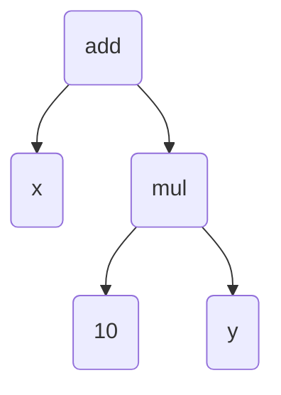

With this tree, we can tell that we do the multiplication first, and the addition second. But with `x + 10 * y`, the most natural thing for people who are used to left-to-right reading is to solve it like `(x + 10) * y`. The tree makes the order in which we have to solve it clear:

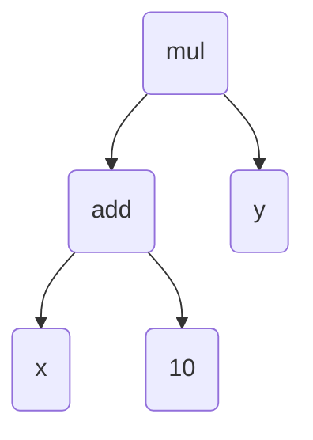


## **Properties**

The properties of operations (commutation, association, distribution) are also easy to visualize with the tree:

### **Commutation**

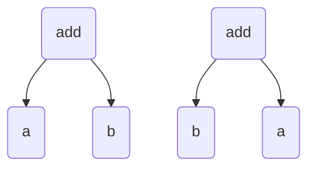


### **Association**


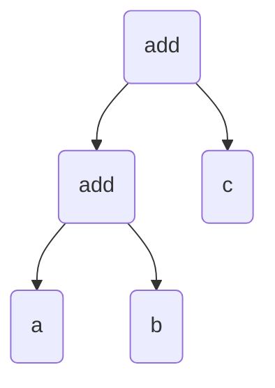

### **Distribution**


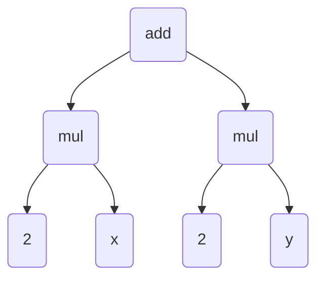

(note: distribution hasn't been implemented in my code [yet](#to-do-list))

The one downside to the tree format is that there are always different levels. For example, when adding `1 + a + 3`, it doesn’t matter which 2 numbers you add first, but with the tree you *have* to have an order. So, the tree will look like this:

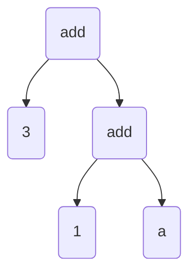

The ideal solution we want is `a + 4`, but in this format, it will first add `1 + a`, which isn't possible since `a` is a variable, and then add `3` to `1 + a`. This will just result in `1 + a + 3` again.

What we want instead is something like this:

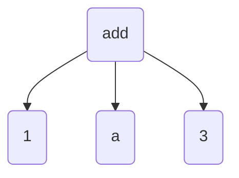

Now, all of them are on the same “level”. Since addition is commutative, we can just re-arrange the expression and add `1` and `3` like so:


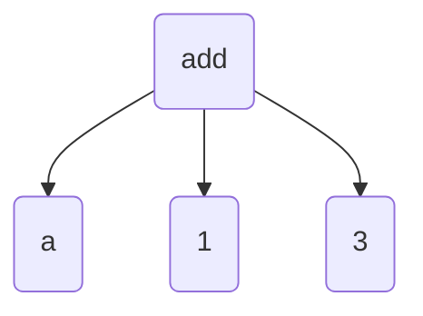

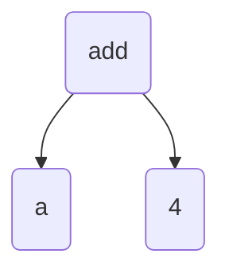

And we’ve got `a + 4`! Perfect!

So, the tree and the textual format are both good for different scenarios, but the tree is helpful when visualizing an expression, and the textual form is good for calculation.

# Code

This section just shows some snippets of the code, if you want to see the full project (or more), it’s open-source [on github](https://github.com/pengvyn/kavpix-code). All of this code is written in TypeScript, with the help of a [few libraries](#libraries)

There are 4 main modules we need to write for this:

1. Parser. It takes the input you type and transforms it into a tree
2. Orderer. Re-arranges the tree to follow the order of operations
3. Evaluator. Takes a tree as input and evaluates/solves it as much as it can.
4. Simplifier. Evaluates the expression even further (more on this later)

## **Parser**

As mentioned before, it transforms a `string` into a tree. Before we start with the function, let's see how the tree is supposed to look.

### **Expression Types**

First, we can start with a simple expression like `1 + 2`. This is how it looks like as a tree


There are three main things here: `add`, `1`, and `2`. If we generalize this, we get `operation`, `number`, and `number` 

Nice! We now know the three things needed for a tree. An object would be perfect for this

```typescript
type Operation = "add" | "sub" | "mul" | "div";

interface Expression {
    left: number,
    right: number,
    operation: Operation
}
```

Now we have a union type for the operation, the left, and the right. With all of these together we have an `Expression`!

This is good, but for a tree like


The right isn't a number. it's another `add`.

```typescript
...

interface Expression {
    left: Expression,
    right: Expression,
    operation: Operation,
}
```

That's better! Now we can have an even bigger tree. But, what about negation? It should be included in `Expression` as well, but it only has 1 value, and not left and right.

#### **Negation**

What if we had a bunch of objects, one for each operation, and one more for Negation? Then, we can make `Expression` a union type of all of those!

```typescript
interface Add {
    left: Expression,
    right: Expression,
    operation: "add",
}
interface Sub {
    left: Expression,
    right: Expression,
    operation: "sub",
}
interface Mul {
    left: Expression,
    right: Expression,
    operation: "mul",
}
interface Div {
    left: Expression,
    right: Expression,
    operation: "div",
}
interface Neg {
    val: Expression, // val is short for value
    operation: "neg",
}

type Expression = Add | Sub | Mul | Div | Neg;
```

#### **Parentheses**

Now that negation is here as well, adding parentheses is simple


```typescript
interface Add {
    left: Expression,
    right: Expression,
    _tag: "add",
}
interface Sub {
    left: Expression,
    right: Expression,
    _tag: "sub",
}
interface Mul {
    left: Expression,
    right: Expression,
    _tag: "mul",
}
interface Div {
    left: Expression,
    right: Expression,
    _tag: "div",
}
interface Neg {
    val: Expression,
    _tag: "neg",
}
interface Group {
    val: Expression,
    _tag: "group",
}

type Expression = Add | Sub | Mul | Div | Neg | Group;
```

I've changed `operation` into `_tag` because `(` and `)` aren't really operations, and `tag` fit better. The underscore is there to differentiate it between the other elements in the object: left, right, or val. 

The tag is needed to know which object is which. When a function takes in an expression, it might not know what expression it is. With the tag, we can tell exactly whether it's `Add`, or `Div`, or something else.

#### **Leaf**

We're almost done with the types, there's just one more `interface` needed. None of the `interface`s have numbers or variables. It's always an expression. This means that adding a number or variable to the tree would give a type error. Let's fix that!

```typescript
...

const _variables = ["a", "b", "c", "d", "e", "f", "g", "h", "i", "j", "k", "l", "m", "n", "o", "p", "q", "r", "s", "t", "u", "v", "w", "x", "y", "z"] as const;
type Variable = typeof _variables[number];

interface VarLeaf { // short for Variable Leaf
    val: Variable,
    _tag: "var",
}
interface ValLeaf { // short for Value Leaf
    val: number,
    _tag: "val"
}
interface Leaf {
    val: VarLeaf | ValLeaf,
    _tag: "leaf"
}

type Expression = Add | Sub | Mul | Div | Neg | Group | Leaf  | VarLeaf | ValLeaf;
```

We've now made 3 new objects: `VarLeaf`, `ValLeaf`, and `Leaf`. With this structure, we have numbers, variables, expressions, and expressions inside of expressions! Awesome

`as const` sets the type of `_variables` to `["a", "b", "c", ... "y", "z"]`. By default, `_variables` is a `string`, but after using `as const`, `_variables` is *only* a list of the lower-case letters.

```typescript
type Variable = typeof _variables[number];
```

Translates to:

```typescript
type Variable = "a" | "b" | "c" | ... "y" | "z";
```

The names `ValLeaf` and `VarLeaf` are a little bit confusing, but it isn't too hard to get the hang of it.

You might be wondering why `ValLeaf` wasn't named something like `NumLeaf`. Even if you weren't, it's because all of the types will be generalized. They don't have to be used only for numbers and variables, but also for other things. Calling it `NumLeaf` means it only applies to numbers, which it doesn't.

#### **Generic Types**

Speaking of generalization, we can use *generic types* for all the objects

A generic type is similar to inputs for functions, but for types.

```typescript
interface ValLeaf<T> {
    val: T,
    _tag: "val"
}
```

Here, `T` is the input type. If we want to use numbers, we would write `ValLeaf<number>`. Or maybe we want to use a list of numbers, then it would be `ValLeaf<number[]>`.

Let's generalize all the previous types

```typescript
interface Add<T> {
    left: Expression<T>,
    right: Expression<T>,
    _tag: "add"
}

...

interface VarLeaf {
    val: Variable,
    _tag: "var"
}
interface ValLeaf<T> {
    val: T,
    _tag: "val"
}
interface Leaf<T> {
    val: VarLeaf | ValLeaf<T>,
    _tag: "leaf"
}

type Expression<T> = Add<T> | Sub<T> | ... ;
```

And we're finished with `Expression`! We can finally move on

### **The 3 boxes**

Okay, now that we've got the expression itself taken care of, we can go a bit deeper into the writing the function. Although, we aren't done with types just yet. For our parser, one method to use is to go character-by-character, which means we use the `.split()` function for the input string, and go from there.

Let's look at an example for `a + b`:

**Character 1: `a`**

`a` is a variable. Remember how we added `VarLeaf` to `Expression`? That means it's an expression on it's own. Let's keep it inside a box for now

```typescript
const parsed: Expression<number> = {
    _tag: "leaf",
    val: {
        _tag: "var",
        val: "a"
    }
}
```

Here's how `parsed` looks so far:

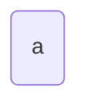

**Character 2: `+`**

`+` is an operator. We can't really do anything with this right now though, since we don't know whats on the right yet. We'll just store it in a different box and wait for the next part.

```typescript
let parsed: Expression<number> = {
    ...
}

let waiting = "+";
```

**Character 3: `b`**

`b` is another variable. There's already a variable in `parsed` and an operator in `waiting`, let's combine these and make a new `Expression`. We have the left and right, `a` and `b`. The operator inside `waiting` is `+`. So, we can create a new `Add`!

```typescript
parsed = {
    _tag: "add",
    left: {
        _tag: "leaf",
        val: {
            _tag: "var",
            val: "a",
        }
    },
    right: {
        _tag: "leaf",
        val: {
            _tag: "var",
            val: "b",
        }
    }
}

waiting = null;
```

`parsed` now looks like this

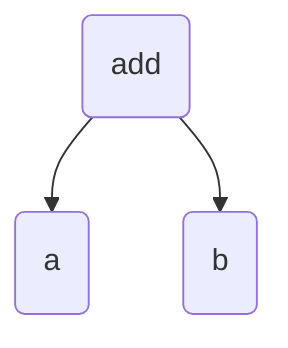

Nice, now we know what we need, one box for the parsed values, and another box for the elements that need more information before they can be parsed. 

The `waiting` box is still a little incomplete. Imagine if the expression was `a + -b` instead. After we put `+` in the waiting, the `-` also needs to be stored somewhere. We could create another box for this, but since `-` is also waiting for more information, let's create a new object `Waiting` and replace the original waiting box to also include negatives:

```typescript
interface Waiting<Operator> {
    operator: Operator,
    negate: boolean,
}
```

`negate` is a `boolean` because there are only two options for it: negate or don't negate.

The example we used before is pretty simple, but what about something like `a + (b * c)`?

The parentheses makes everything a lot more complicated, but one nice method is to just keep `b * c` stored in `waiting`, and then parse that bit separately by calling our parser again. Let's add another element to `Waiting`:

```typescript
interface Grouped {
    _tag: "grouped",
    exp: string,
}
interface UnGrouped {
    _tag: "ungrouped",
    exp: null,
}
type GroupWait = Grouped | UnGrouped;

interface Waiting {
    operator: Operator,
    negate: boolean,
    group: GroupWait,
}
```

Perfect! Onto our third and final box.

The `parsed` and `waiting` boxes seem like enough, but there's just one more we need. Imagine if someone makes a typo and types `a ++ b` instead of `a + b`. We can't parse that. After `+`, we're expecting either parentheses, a negative sign, or a variable/number next. We need to send an error for that. Let's create a box for what we expect, and if the character doesn't match out expectations, we throw an error.

```typescript
type ExpectedNum = "number" | "variable" | "operator" | "neg" | "group";
```

Now that we officially have 3 boxes, let's make the parser!

### **The parser function**

Let's start out by defining the function:

```typescript
function parseInput(input: string): Expression<number> | null {

}
```
The return type could be `null` if the input is `""` (empty string)

#### **Preparing the input**

Before we add our 3 boxes into the function, let's tweak the input a tiny bit to make it easier for us. Since we're going character by character, we can use the `.split("")` function to make the string into a list. 

But, when someone types in `1 + a`, we only need 3 things: `1`, `+`, and `a`. When we use split, we get `["1", " ", "+", " ", "a"]`. All of those spaces are not needed, so let's just get rid of it using `.replaceAll()`:

```typescript
function parseInput(input: string): Expression<number> | null {
    const withoutSpaces = input.replaceAll(" ", "");
    const splitInp = withoutSpaces.split("");
}
```

All the unnecessary spaces have been removed! But, if someone types in an expression with a 2 digit number, like `10 + a`, it will result in `["1", "0", "+", "a"]`. But we don't want `["1", "0", ...]`, we want `["10", ...]`. Let's write a new function to join them together:

#### **Join Similarities**

```typescript
function joinSimilarities(list: string[], similarities: string[]): string[] {
    return list.reduce((prev: string[], current: string) => prev.length === 0
        ? [current]
        : similarities.includes(current)
            ? similarities.includes(prev[prev.length - 1][0])
                ? [...prev.slice(0, prev.length - 1), prev[prev.length - 1] + current]
                : [...prev, current]
            : [...prev, current],
        []
    )
}
```

It takes in a list that needs to be compressed (`["1", "0", "+", "a"]`, for example), and another list for the "similar" things. For us, the similar things would be `["0", "1", "2", "3", "4", "5", "7", "8", "9"]`. 

`joinSimilarities` uses the [`reduce()`](https://developer.mozilla.org/en-US/docs/Web/JavaScript/Reference/Global_Objects/Array/reduce) function to go through each element. It's basically like a for loop, but it has a `previousValue` and a `currentValue`. In our case, if both of them are numbers, the function will join it together.

The part inside the reduce function has a lot of [ternary operator](https://developer.mozilla.org/en-US/docs/Web/JavaScript/Reference/Operators/Conditional_operator) branches, so here is how it is with english mixed in with the code:
```
if prev.length === 0

    ? [current]

    : if the current value is in the list of similarities,

        ? if the similarities also includes the value just before this current value,

            ? create a new list with the all of the previous value's elements except the very last one, join the last one and the current value, and put it into the list.

            : just add the current value to the previous value list

        : just add the current value to the previous value list
```

It's a little bit complicated, but all it does is transform an expression like `["1", "0", "+", "a"]` to `["10", "+", "a"]`.

And with everything put together, the code looks like this:

```typescript
function joinSimilarities(list: string[], similarities: string[]): string[] {
    return list.reduce((prev: string[], current: string) => prev.length === 0
        ? [current]
        : similarities.includes(current)
            ? similarities.includes(prev[prev.length - 1][0])
                ? [...prev.slice(0, prev.length - 1), prev[prev.length - 1] + current]
                : [...prev, current]
            : [...prev, current],
        []
    )
}

function parseInput(input: string): Expression<number> | null {
    const splitInp = input.split("");
    const withoutSpaces = listed.replaceAll(" ", "");
    const listed = joinSimilarities(withoutSpaces, "0123456789".split(""));
}
```

#### **Using the boxes**

Now that the input is ready to go, it's time to add the boxes we made earlier!

```typescript
...

type NumberOperator = "+" | "*" | "-" | "/";
type ExpectedValue = "number" | "variable" | "operator" | "group" | "neg";

function parseInput(input: string): Expression<number> | null {
    ...

    let parsed: Expression<number> | null = null;
    let waiting: Waiting<NumberOperator> = {
        operator: null,
        negate: false,
        group: {
            _tag: "ungrouped", 
            exp: null
        }
    }
    let nextExp: ExpectedValue[] = ["number", "variable", "group", "neg"];
}
```

Now that all of that is out of the way, let's start with the loop!

#### **The For Loop**

Let's use a `for` loop to go through each character. The first thing we need to do in the `for` loop is to check if the value is expected, if it isn't then the whole loop has to stop immediately

```typescript
...

function parseInput(input: string): Expression<number> | null {
    ...
    for(let idx = 0; idx < listed.length; idx++) {
        const curVal: string = listed[idx];
        
        if(!isExpected(curVal, nextExp)) {
            throw "Error: Unexpected value"l
        }
    }
}
```

The `isExpected` function just checks if the value is a part of the `nextExp`.

We already know the possible types of characters that come in each loop (neg, number, group, variable, operator), so we can use `if` to decide what to do. Before we actually make it do anything, let's plan out the structure:


```typescript
...

type NumberOperator = "+" | "-" | "*" | "/";
const numberOperators = ["+", "-", "*", "/"];

...

const numberOperators: NumberOperator[] = ["+"]

function parseInput(input: string): Expression<number> | null {
    ...
    for(let idx = 0; idx < listed.length; idx++) {
        const curVal: string = listed[idx];
        
        if(!isExpected(curVal, nextExp)) {
            throw "Error: Unexpected value"l
        }

        const shouldHandleGroup = waiting.group._tag === "grouped" || curVal === "(" || curVal === ")";

        if(shouldHandleGroup) {

        }

        const shouldHandleNeg = curVal === "-" && (waiting.operator !== null || parsed === null);
        // if waiting.operator is null, and parsed is not null, it means that curVal is for subtraction and not negation.

        if(shouldHandleNeg) {

        }

        if((numberOperators as string[]).includes(curVal)) { // if curVal is an operator

        }

        if((variables as string[]).includes(curVal)) {

        }
        
        // if none of the above, curVal is a number.
    }
    return parsed;
}
```

Instead of actually handling each one of those inside the `if` block, let's create functions to handle them, and call those function inside the `if`s.

#### **Value handlers**

Each of the functions will do some of these 3 things

- Update `parsed`
- Update `waiting`
- Update `nextExpected`

First, the number handler!

```typescript
interface ParsedWaitNext<T, Op, NE> {
    parsed: Expression<T>,
    waiting: Waiting<Op>,
    next: NE[],
}

function valueIsNumber(
    value: number, 
    parsed: Expression<number> | null, 
    waiting: Waiting<NumberOperator>
): ParsedWaitNext<number, NumberOperator, ExpectedValue> {
    if(waiting.negate) {

    }
}
```

The `ParsedWaitNext` interface is needed because we need our main `parseInput` function to get all the 3.

We've stopped here because we are going to be changing `parsed` a lot. It's pretty tiring to keep typing all the curly braces over and over, so why don't we just make a function that does it for us?

```typescript
function makeNumExp(
    leftOrValue: Expression<number>,
    right: Expression<number> | null,
    tag: NumberOperator | "neg" | "group",
): Expression<number> {
    ...
}

function makeLeaf(val: T | Variable): Leaf<T> {
    ...
}
```

If you want to check out the contents of the functions, click [here]() to see it on github.

`makeLeaf` is pretty straightforward, it takes a `T` or a `Variable`, makes a `VarLeaf` or a `ValLeaf<T>` from it, and then puts that into a `Leaf`.

`makeNumExp` takes a left, right, and a tag. If `tag` is `"neg"` or `"group"`, the left is the value and right is `null`. All it does is create a new `Expression` with the inputs. For example,

```typescript
const exp = makeNumExp(
    {
        _tag: "leaf",
        val: {
            _tag: "var",
            val: "a",
        }
    },
    {
        _tag: "leaf",
        val: {
            _tag: "var",
            val: "b",
        }
    },
    "*"
)

const result = {
    _tag: "mul",
    left: {
        _tag: "leaf",
        val: {
            _tag: "var",
            val: "a",
        }
    },
    right: {
        _tag: "leaf",
        val: {
            _tag: "var",
            val: "b",
        }
    }
}
```

`exp` and `result` are equal.

And now, to pick up where we left off

```typescript
function valueIsNumber(
    value: number, 
    parsed: Expression<number> | null, 
    waiting: Waiting<NumberOperator>
): ParsedWaitNext<number, NumberOperator, ExpectedValue> {
    if(waiting.negate) {

    }
}
```

Let's use `makeNumExp`!

```typescript
function valueIsNumber(
    value: number, 
    parsed: Expression<number> | null, 
    waiting: Waiting<NumberOperator>
): ParsedWaitNext<number, NumberOperator, ExpectedValue> {
    const leafed = makeLeaf(value);

    const newBranch: Expression<number> = waiting.negate
        ? makeNumExp(leafed, null, "neg")
        : value
    
    const newParsed: Expression<number> = parsed === null
        ? newBranch
        : makeNumExp(parsed, newBranch, waiting.operator as NumberOperator)

    const newNext: ExpectedValue[] = ["operator", "group"];
    const newWaiting: Waiting<NumberOperator> = {
        operator: null,
        negate: false,
        group: {
            _tag: "ungrouped",
            exp: null,
        }
    }
    return {
        parsed: newParsed,
        waiting: newWaiting,
        next: newNext,
    }
}
```

What the code above is doing is, first it checks if `waiting.negate` is `true`. If it is, it means `value` needs to be negated, so it makes a new `Neg` for the value. If `waiting.negate` is `false`, it just sets the value as the branch.

Then, for the parsed, if `parsed` is `null`, it means that this number is the first part of the expression. Which means nothing needs to be done, so `newParsed` gets set to `newBranch`. If it isn't `null`, though, `parsed` and `newBranch` need to be combined using the operator in `waiting`.

The next expected from here is only `["operator", "group"]`. Other than an operator, or a `)` (closed parentheses), nothing else can come after a number.

`newWaiting` is just the default `Waiting`. 


Now let's write a `valueIsVariable` function

```typescript
function valueIsVariable(
    value: Variable, 
    parsed: Expression<number> | null, 
    waiting: Waiting<NumberOperator>
): ParsedWaitNext<number, NumberOperator, ExpectedValue> {
    const leafed = makeLeaf(value);

    const newBranch: Expression<number> = waiting.negate
        ? makeNumExp(leafed, null, "neg")
        : value
    
    const newParsed: Expression<number> = parsed === null
        ? newBranch
        : makeNumExp(parsed, newBranch, waiting.operator as NumberOperator)

    const newNext: ExpectedValue[] = ["operator"];
    const newWaiting: Waiting<NumberOperator> = {
        operator: null,
        negate: false,
        group: {
            _tag: "ungrouped",
            exp: null,
        }
    }
    return {
        parsed: newParsed,
        waiting: newWaiting,
        next: newNext,
    }
}
```

The `valueIsVariable` and `valueIsNumber` functions are exactly the same, except for in the 2nd line:

```typescript
function valueIsVariable(
    value: Variable, // <-- number or Variable
    parsed: Expression<number> | null,
    
    ...
```

So, why don't we just combine them?

```typescript
function valueIsNumOrVar(
    value: number | Variable, 
    parsed: Expression<number> | null, 
    waiting: Waiting<NumberOperator>
): ParsedWaitNext<number, NumberOperator, ExpectedValue> {

    ...

```
Awesome! Let's see how this looks when implemented in `parseInput`

```typescript
function valueIsNumOrVar(
    value: number | Variable, 
    parsed: Expression<number> | null, 
    waiting: Waiting<NumberOperator>
): ParsedWaitNext<number, NumberOperator, ExpectedValue> {
    const leafed = makeLeaf(value);

    const newBranch: Expression<number> = waiting.negate
        ? makeNumExp(leafed, null, "neg")
        : value
    
    const newParsed: Expression<number> = parsed === null
        ? newBranch
        : makeNumExp(parsed, newBranch, waiting.operator as NumberOperator)

    const newNext: ExpectedValue[] = ["operator"];
    const newWaiting: Waiting<NumberOperator> = {
        operator: null,
        negate: false,
        group: {
            _tag: "ungrouped",
            exp: null,
        }
    }
    return {
        parsed: newParsed,
        waiting: newWaiting,
        next: newNext,
    }
}

function parseInput(input: string): Expression<number> | null {
    const splitInp = input.split("");
    const withoutSpaces = listed.replaceAll(" ", "");
    const listed = joinSimilarities(withoutSpaces, "0123456789".split(""));

    let parsed: Expression<number> | null = null;
    let waiting: Waiting<NumberOperator> = {
        operator: null,
        negate: false,
        group: {
            _tag: "ungrouped", 
            exp: null
        }
    }
    let nextExp: ExpectedValue[] = ["number", "variable", "group", "neg"];

    for(let idx = 0; idx < listed.length; idx++) {
        const curVal: string = listed[idx];
        
        if(!isExpected(curVal, nextExp)) {
            throw "Error: Unexpected value"l
        }

        const shouldHandleGroup = waiting.group._tag === "grouped" || curVal === "(" || curVal === ")";

        const shouldHandleNeg = curVal === "-" && (waiting.operator !== null || parsed === null);

        const pwn: ParsedWaitNext< ... > = shouldHandleGroup
            ? // valueIsGroup()
            : shouldHandleNeg
                ? // valueIsNeg()
                : (numberOperators as string[]).includes(curVal)
                    ? // valueIsOperator()
                    : valueIsNumOrVar(
                        (variables as string[]).includes(curVal)
                            ? curVal
                            : JSON.parse(curVal) // converts a string like "10" into the actual number 10
                        parsed,
                        waiting
                    )
        
        parsed = pwn.parsed;
        waiting = pwn.waiting;
        nextExp = pwn.next;
    }
    return parsed;
}
```

The `if`s have also been changed to ternary operators since it looks more compact now. `curVal` is always a string, so I had to use `JSON.parse()` to make it a number.

Everything's looking pretty good so far! 3 more handler functions to go!

Let's write the `valueIsNeg()` function, it shouldn't be too complicated.

```typescript
function valueIsNeg(
    parsed: Expression<number> | null, 
    waiting: Waiting<NumberOperator>
    ): ParsedWaitNext<number, NumberOperator, ExpectedNumVal> {
        const newWaiting: Waiting<NumberOperator> = {...waiting, negate: true};
        const nextExp: ExpectedNumVal[] = ["number", "group", "variable"];
        return {parsed, waiting: newWaiting, next: nextExp};
}
```

Since `parsed` doesn't change, all that needs to happen is to set `waiting.negate` to `true` and update `nextExp`.

And now `valueIsOperator()`:

```typescript
export function valueIsOperator(
    value: NumberOperator, 
    parsed: Expression<number>, 
    waiting: Waiting<NumberOperator>
    ): ParsedWaitNext<number, NumberOperator, ExpectedNumVal> {
        const newWaiting: Waiting<NumberOperator> = {...waiting, operator: value};
        const nextExp: ExpectedNumVal[] = ["neg", "number", "group", "variable"];
        return {parsed, waiting: newWaiting, next: nextExp};
}
```

Again, nothing complex since we just had to put the operator in `waiting`.

Finally, `valueIsGroup()`. This one *is* a bit complicated, though.

There are many things that could happen. The value could be `(`, or `)`. Actually, it could also be anything else. If `waiting.group._tag` is `grouped`, it means the value needs to be added into `waiting.group.exp`. If the value is `)`, it means we have to parse `waiting.group.exp`, and combine that with our original `parsed`. 

But that's not all, what about nested parentheses? An expression like `a + (b * (c - d))` will result in, `b * (c - d` being added into `waiting.group.exp`, and then it'll stop after `d` because of the closing parentheses. We don't want this though, we want `b * (c - d)` to be added, and stop after that.

Let's take care of the nested parentheses problem. What we need is an *extra* closing parentheses. In `b * (c - d)`, the number of closing parentheses is the same as the number of opening parentheses. But, with `b * (c - d))`, We have an extra closing parentheses! This means we can stop now, parse the expression, and add it to `parsed`. 

Okay, we need to write a function that checks if there are more of `)` than `(`.

```typescript
function shouldParseGroup(exp: string): boolean {
    const listed = exp.split("");

    const openParentheses = listed.filter((c) => c === "(");
    const closedParentheses = listed.filter((c) => c === ")");

    return closedParentheses.length > openParentheses.length;
}
```

What this function does is it filters out all of the `(`s from the expression, and all of the `)`s, then sees which one has more. If there are more `)`s, it returns true, meaning we have to parse the expression. If it returns false, we add it to `waiting.group.exp`.

```typescript
function valueIsOrInGroup(
    parsed: Expression<number> | null,
    waiting: Waiting<NumberOperator>,
    value: string
): ParsedWaitNext<number, NumberOperator, ExpectedNumVal> {
    if(value === ")") {
        // if closed parentheses
    } else if(waiting.group._tag === "grouped") {
        // if _tag is "grouped" then it can't be open parentheses
        // (unless it's nested)
    } else {
        // open parentheses
    }
}
```

Since there are 3 options here, let's just create 3 more functions: `valueIsClosedGroup`, `valueIsOpenGroup`, and `valueIsInGroup`.

For `valueIsInGroup`, the only things we need to do is add the value to `waiting.group.exp` and update `nextExp`. Easy!

```typescript
function valueIsInGroup(
    parsed: Expression<number> | null,
    waiting: Waiting<NumberOperator>,
    value: string
): ParsedWaitNext<number, NumberOperator, ExpectedNumVal> {
    return {
        parsed,
        waiting: {
            ...waiting, 
            group: {
                ...waiting.group,
                exp: waiting.group.exp + value,
            }
        },
        next: ["neg", "number", "group", "operator", "variable"]
    }
}
```

`valueIsOpenParentheses()` is also pretty easy:

```typescript
function valueIsOpenParentheses(
    parsed: Expression<number> | null,
    waiting: Waiting<NumberOperator>
): ParsedWaitNext<number, NumberOperator, ExpectedNumVal> {
    return {
        parsed,
        waiting: {
            ...waiting,
            group: {_tag: "grouped", exp: ""}
        },
        next: ["neg", "number", "variable", "group"]
    }
}
```

And finally, `valueIsClosedParentheses()`:

```typescript
function shouldParseGroup(exp: string): boolean {
    const listed = exp.split("");

    const openParentheses = listed.filter((c) => c === "(");
    const closedParentheses = listed.filter((c) => c === ")");

    return closedParentheses.length > openParentheses.length;
}

function valueIsClosedParentheses(
    parsed: Expression<number> | null,
    waiting: Waiting<NumberOperator>
): ParsedWaitNext<number, NumberOperator, ExpectedNumVal> {
    const exp = waiting.group.exp;

    if(shouldParseGroup(exp)) {
        const parsedExpNoNeg = parseInput(exp);
        const parsedExp = waiting.negate 
            ? makeNumExp(parsedExpNoNeg, null, "neg") 
            : parsedExpNoNeg
        return {
            parsed: parsed === null
                ? parsedExp
                : makeNumExp(parsed, parsedExp, waiting.operator),
            waiting: {operator: null, group: {_tag: "ungrouped", exp: null}},
            next: ["operator", "group"]
        }
    }
    return {
        parsed,
        waiting: {
            ...waiting,
            group: {
                _tag: "grouped",
                exp: exp + ")"
            }
        },
        next: ["operator", "group"]
    }
}
```

First, the function checks if the expression has to be parsed using the function we made before.

If it does have to be parsed, it calls, `parseInput()` and parses it. It negates it if needed, and then combines it with `parsed`, if `parsed` isn't null. 

If it doesn't have to be parsed, it does the same thing `valueIsInGroup()` does.

Okay! It's time to put all of them into `valueIsOrInGroup`!

```typescript
function valueIsInGroup(
    parsed: Expression<number> | null,
    waiting: Waiting<NumberOperator>,
    value: string
): ParsedWaitNext<number, NumberOperator, ExpectedNumVal> {
    return {
        parsed,
        waiting: {
            ...waiting, 
            group: {
                ...waiting.group,
                exp: waiting.group.exp + value,
            }
        },
        next: ["neg", "number", "group", "operator", "variable"]
    }
}
function valueIsOpenParentheses(
    parsed: Expression<number> | null,
    waiting: Waiting<NumberOperator>
): ParsedWaitNext<number, NumberOperator, ExpectedNumVal> {
    return {
        parsed,
        waiting: {
            ...waiting,
            group: {_tag: "grouped", exp: ""}
        },
        next: ["neg", "number", "variable", "group"]
    }
}

function shouldParseGroup(exp: string): boolean {
    const listed = exp.split("");

    const openParentheses = listed.filter((c) => c === "(");
    const closedParentheses = listed.filter((c) => c === ")");

    return closedParentheses.length > openParentheses.length;
}

function valueIsClosedParentheses(
    parsed: Expression<number> | null,
    waiting: Waiting<NumberOperator>
): ParsedWaitNext<number, NumberOperator, ExpectedNumVal> {
    const exp = waiting.group.exp;

    if(shouldParseGroup(exp)) {
        const parsedExpNoNeg = parseInput(exp);
        const parsedExp = waiting.negate 
            ? makeNumExp(parsedExpNoNeg, null, "neg") 
            : parsedExpNoNeg
        return {
            parsed: parsed === null
                ? parsedExp
                : makeNumExp(parsed, parsedExp, waiting.operator),
            waiting: {operator: null, group: {_tag: "ungrouped", exp: null}},
            next: ["operator", "group"]
        }
    }
    return {
        parsed,
        waiting: {
            ...waiting,
            group: {
                _tag: "grouped",
                exp: exp + ")"
            }
        },
        next: ["operator", "group"]
    }
}

function valueIsOrInGroup(
    parsed: Expression<number> | null,
    waiting: Waiting<NumberOperator>,
    value: string
): ParsedWaitNext<number, NumberOperator, ExpectedNumVal> {
    let pwn;
    if(value === ")") {
       pwn = valueIsClosedParentheses(parsed, waiting);
    } else if(waiting.group._tag === "grouped") {
        pwn = valueIsInGroup(parsed, waiting, value);
    } else {
        pwn = valueIsOpenParentheses(parsed, waiting);
    }
    return pwn;
}
```

And here's how `parseInput()` looks with all the new functions added into it:

```typescript

function parseInput(input: string): Expression<number> | null {
    const splitInp = input.split("");
    const withoutSpaces = listed.replaceAll(" ", "");
    const listed = joinSimilarities(withoutSpaces, "0123456789".split(""));

    let parsed: Expression<number> | null = null;
    let waiting: Waiting<NumberOperator> = {
        operator: null,
        negate: false,
        group: {
            _tag: "ungrouped", 
            exp: null
        }
    }
    let nextExp: ExpectedValue[] = ["number", "variable", "group", "neg"];

    for(let idx = 0; idx < listed.length; idx++) {
        const curVal: string = listed[idx];
        
        if(!isExpected(curVal, nextExp)) {
            throw "Error: Unexpected value"l
        }

        const shouldHandleGroup = waiting.group._tag === "grouped" || curVal === "(" || curVal === ")";

        const shouldHandleNeg = curVal === "-" && (waiting.operator !== null || parsed === null);

        const pwn: ParsedWaitNext< ... > = shouldHandleGroup
            ? valueIsOrInGroup(parsed, waiting, curVal)
            : shouldHandleNeg
                ? valueIsNeg(parsed, waiting)
                : (numberOperators as string[]).includes(curVal)
                    ? valueIsOperator(parsed, waiting, curVal)
                    : valueIsNumOrVar(
                        (variables as string[]).includes(curVal)
                            ? curVal
                            : JSON.parse(curVal)
                        parsed,
                        waiting
                    )
        
        parsed = pwn.parsed;
        waiting = pwn.waiting;
        nextExp = pwn.next;
    }
    return parsed;
}
```

Awesome! We've finally finished our parser!!

## **Orderer**

The tree that `parseInput()` makes is actually left-to-right. It doesn't follow the operation precedence. If we give it an expression like `a + b * c`, this is how it looks:

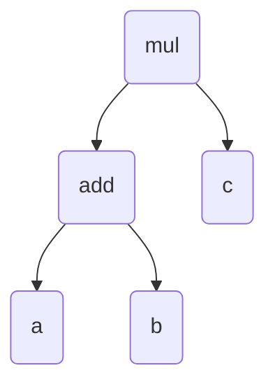

If we add parentheses and translate it back to textual form, it would be `(a + b) * c`. But, what we want is

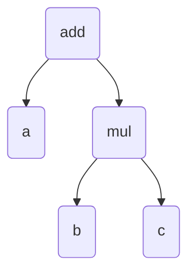

Which translates to `a + (b * c)`. We need to write a function to do that ordering for us.

With the same example as before, let's look at what exactly we need to do.

### **Re-arranging**

There are 3 scenarios in which we need to re-arrange the tree: `a + b * c`, `a * b + c` (normally this one works fine, but we still need to re-arrange it if it ends up like `a * (b + c)`), and `a + b * c + d`. Let's go one by one, starting with `a + b * c`:

#### **Precedence 1**

**Step 1**

```mermaid
    graph TD;
        mul(mul) --> add(add);
        mul --> c(c);
        add --> a(a);
        add --> b(b);
```

The initial tree which we need to change

**Step 2**

```mermaid
    graph TD;
        add(add) --> a(a);
        add --> b(b);
        mul(mul) --> c(c);
```

We've now disconnected `mul` from `add`

**Step 3**

```mermaid
    graph TD;
        add(add) --> a(a);
        mul(mul) --> b(b);
        mul --> c(c);
```

We've given `add`'s `b` to `mul`, and put it in `mul`'s left.

**Step 4**

```mermaid
    graph TD;
        add(add) --> a(a);
        add --> mul(mul);
        mul --> b(b);
        mul --> c(c);
```

And finally `add` and `mul` have been joined together again, but this time `mul` is in `add`'s right.

Since multiplication has higher precedence than addition, it uses `b`.

Here's what we did in words:

1. Remove the `left` from the root.
2. Take the `right` of the `left`, and attach it to the `left` of the root.
3. Attach the root to the `right` of the `left`.

(This is very hard to follow, but it's easier with the images as reference)

#### **Precedence 2**

For `a * b + c` (this works if we go left to right, but in the tree it is formatted like `(a * b) + c`)

**Step 1**

```mermaid
    graph TD;
        mul(mul) --> a(a)
        add(add) --> b(b)
        add --> c(c)
        mul --> add
```

The starting tree

**Step 2**

```mermaid
    graph TD;
        mul(mul) --> a(a)
        add(add) --> b(b)
        add --> c(c)
```

`add` has been split from `mul`

**Step 3**

```mermaid
    graph TD;
        mul(mul) --> a(a)
        mul(mul) --> b(b)
        add(add) --> c(c)
```

We've given `b` to `mul`'s right from `add`

**Step 4**

```mermaid
    graph TD;
        mul(mul) --> a(a)
        mul(mul) --> b(b)
        add(add) --> mul
        add --> c(c)
```

`mul` and `add` have been rejoined. We put `mul` in `add`'s left.

And in words:

1. Remove `right` from the root
2. Take the `left` from `right` and attach it to the `right` of the `root`
3. Attach the root to the `left` of `right`

#### **Precedence 3**

For `a + b * c + d`

**Step 1**

```mermaid
    graph TD;
        mul(mul) --> add1(add)
        mul(mul) --> add2(add)
        add1 --> a(a)
        add1 --> b(b)
        add2 --> c(c)
        add2 --> d(d)
```

Initial tree

**Step 2**

```mermaid
    graph TD;
        mul(mul) --> add1(add)
        add1 --> a(a)
        add1 --> b(b)
        add2(add) --> c(c)
        add2 --> d(d)
```

We've removed the `add` on the right side of `mul`

**Step 3**

```mermaid
    graph TD;
        add1(add) --> a(a)
        add1 --> b(b)
        mul(mul)
        add2(add) --> c(c)
        add2 --> d(d)
```

We've split the other `add` and `mul`

**Step 4**

```mermaid
    graph TD;
        add1(add) --> a(a)
        mul(mul) --> b(b)
        add2(add) --> c(c)
        add2 --> d(d)
```

We've given the left `add`'s `b` to `mul`.

**Step 5**

```mermaid
    graph TD;
        add1(add) --> a(a)
        mul(mul) --> b(b)
        mul --> c(c)
        add2(add) --> d(d)
```

We've put `c` in `mul`'s right

**Step 6**

```mermaid
    graph TD;
        add1(add) --> a(a)
        add1(add) --> mul
        mul(mul) --> b(b)
        mul --> c(c)
        add2(add) --> d(d)
```

And now we've attached `mul` to the left `add`

**Step 7**

```mermaid
    graph TD;
        add2(add) --> add1
        add2 --> d(d)
        add1(add) --> a(a)
        add1(add) --> mul
        mul(mul) --> b(b)
        mul --> c(c)
        
```

For the final step we've attached the left `add` to right `add`.

In words:

1. Remove `left` from the root
2. Remove `right` from the root
3. Attach `left`'s `right` to the root's `left`
4. Attach `right`'s `left` to the root's `right`
5. Attach the root to the `left`'s `right`
6. Attach `left` to `right`'s `left`

#### Precedence code

This is the kind of thing that's seems simple until you write it down. But, we've got the 3 precedences generalized with the words. We can apply this to our code now!

## Summary

### To-Do list

### Libraries